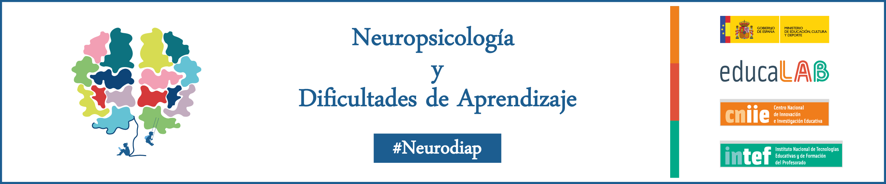

# Introducción

En el informe de 2007 de la OCDE (en inglés) Understanding the Brain: The Bird of a Learning Science, se afirma que los avances en el campo de la neurociencia son relevantes para la educación. Específicamente es la Neuropsicología educativa la que está aportando nuevos conocimientos de los procesos de aprendizaje, tanto de sus bases neuropsicológicas como de los niveles de neurodesarrollo de cada etapa educativa para prevenir dificultades, desarrollar capacidades, inteligencias y talentos, así como para ofrecer una respuesta educativa, científica y profesional, que haga posible la aplicación de metodologías, programas y recursos acordes con la sociedad actual.
Este curso está elaborado con la finalidad de proporcionar herramientas específicas para la actuación a nivel psicoeducativo en las principales dificultades de aprendizaje existentes en el contexto escolar, así como sobre los procesos perceptivos y cognitivos implicados en ellas.

El curso "Neuropsicología y Dificultades de Aprendizaje" contribuye al desarrollo y mejora de la Competencia Digital Docente en el Área 2. Comunicación y colaboración, y en el Área 5, Resolución de problemas, del “Marco Común de Competencia Digital Docente”.

La realización del plan de actividades del curso te ayudará a alcanzar el nivel:

* B2 de la competencia 2.2 Compartir información y contenidos digitales, ya que trabaja el siguiente descriptor: "Uso de forma habitual los espacios en línea para compartir recursos educativos y publicar mensajes de contenido educativo en redes sociales".

* B2 de la competencia 2.4 Colaboración mediante canales digitales, ya que trabaja el siguiente descriptor: "Organizo actividades para estimular en el alumnado el uso de recursos en línea de trabajo colaborativo".

* B2 de la competencia 5.2 Identificación de necesidades y respuestas tecnológicas, ya que trabaja el siguiente descriptor: "Diagnostico el grado de desarrollo de la competencia digital de mi alumnado y en función de ello diseño y desarrollo actividades en línea para mejorarlas".

* B2 de la competencia 5.4, Identificación de lagunas en la competencia digital, ya que trabaja el siguiente descriptor: "Elaboro y desarrollo actividades de aula y/o de centro que mejoren la competencia digital de mi alumnado".

