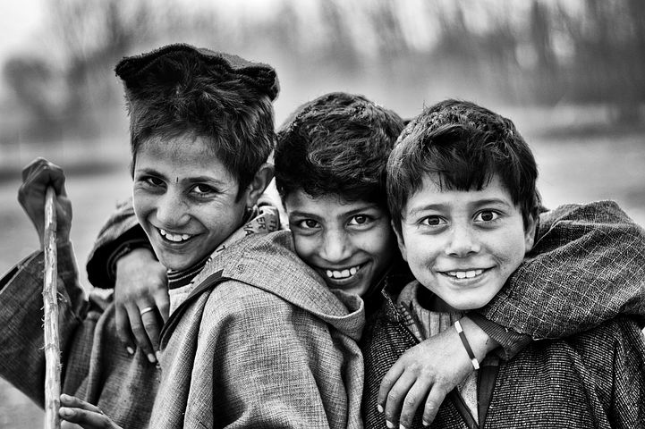

# Actividades de enseñanza para adquirir/desarrollar el proceso

_Imagen tomada de Pixabay  
_

**  
1\. Al trabajar la pragmática del lenguaje se pueden** **trabajar diferentes aspectos**:

*   Usar convenientemente el lenguaje en todos los ámbitos de comunicación.
    
*   Establecer un uso maduro del lenguaje en todos sus aspectos.
    
*   Entender usos del lenguaje, como la ironía, el humor, el doble sentido, las inferencias, la ampliación de conocimientos, etc.
    
*   Comprender diferentes formas de representación del lenguaje (oral, escrito, matemático)
    

**  
2\. Para ello se pueden llevar a cabo actividades como:**

*   _Darle palabras sueltas_. El niño construirá con ellas frases: casa, mesa, ropa, puerta, libro, lápiz, jabón, cuchillo, agua, vaso, flor, tenedor
    
*   _Darle una frase incompleta_. El niño deberá completarla con la palabra adecuada
    
*   _Explicará a los compañeros cómo se juega a un determinado juego_: Al cogido, al escondite, al fútbol, al baloncesto, a las canicas.
    
*   _Contar su propia historia_ (Organización familiar, procedencia,...)
    
*    _Utilizar historietas y que narre o describa lo que ocurre_.
    
*   _Redactar un cuento_
    
*   _Trabajar con los números y su escritura_. Por ejemplo: 4-cuatro, 202-doscientos dos, etc.
    
*   _Realizar figuras_ (cara, coche, etc.) a través de la unión de puntos, resultado, o bien de la secuencia de números (2, 3, 4, etc.) o de la realización correcta de una operación matemática (4-2=3; 3+1=4, etc.)
    
*   _Trabajar conceptos como más-menos, suma-resta, etc_.
    
*   _Realizar representaciones de objetos de acuerdo a un patrón_. Por ejemplo: _hacer conjuntos de todas las piezas con tres lados y de color rojo._
    
*   _Jugar a realizar la compra_ (peso de los productos, pago de los mismos, etc.)
    
*   _Indicar analogías y diferencias entre dos cosas_ (perro y gato, p.ej).
    
*   _Responder a preguntas sobre situaciones sociales_ ¿Qué harías si el peluquero te cortase el pelo más corto de cómo lo querías?
    
*   _Dar explicaciones lógicas a situaciones de la vida real_ (¿Vas a tu casa desde el colegio y empieza a llover. ¿Qué harías?)
    
*   _Inventar situaciones cómicas_
    
*   _Trabajar el contacto social_: cómo se establece, cómo se mantiene y se comprueba durante una conversación, cómo se cierra, etc.
    
*   _Trabajar las expresiones faciales_.
    
*   _Trabajar la prosodia y el tono_. Por ejemplo, dos interlocutores dialogan usando siempre la misma frase, pero cambiando el tono y la mímica, por ejemplo: A: Qué hermoso día B: ¿Qué hermoso día? A: ¡¿Qué hermoso día?! B: ¡¡Qué hermoso día!!
    
*   _Trabajar el significado según el contexto_. Por ejemplo, utilizar la misma frase en situaciones diferentes y en diversos contextos para descubrir los cambios de significado (Hoy es un día estupendo pronunciado por: dos chicas que quieren ir de excursión; dos vendedores de paraguas; el automovilista que encuentra una multa en el limpiaparabrisas; la esquiadora caída en la pista; el peatón que quiere detener al hombre que intenta suicidarse, etc).
    
*   _Trabajar la audiencia_. Por ejemplo, cómo explicaría por qué ayer por la tarde no asistió a clase a la maestra y a un compañero de mesa.