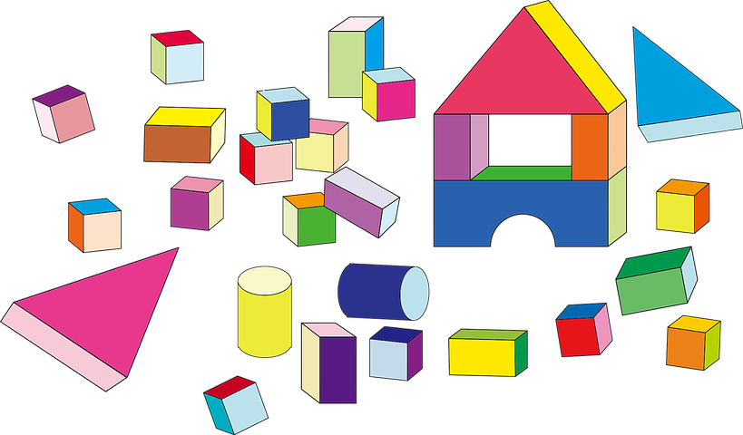

# ATENCIÓN

_Imagen tomada de Pixabay_

La atención es una capacidad básica, no solo en el contexto académico, sino también para la vida diaria. Podemos considerar la atención como el eje que fundamenta cualquier otro proceso perceptivo y cognitivo, ya que estará involucrada en prácticamente cualquier actividad que realicemos, aunque no siempre en la misma medida.

A lo largo de este apartado, partiremos de la conceptualización de la atención y de la diferenciación de los tipos de atención más relevantes en el contexto educativo, para conocer su patrón de desarrollo y aquellas señales que pudieran estar reflejando dificultades atencionales en nuestros alumnos. Finalmente, estableceremos una serie de pautas básicas para trabajar la atención en el aula, y propondremos modelos de actividades concretas que nos permitirán desarrollarla.   

   
  

## Para reflexión:

La atención es un proceso cognitivo que tenemos en constante funcionamiento. Para que lo puedas comprobar sigue las siguientes indicaciones:

1\. Ahora mismo estás concentrado leyendo la pantalla, ¿verdad? Mira a tu alrededor para identificar bien cómo es la sala en la que te encuentras.

2\. ¿Qué sonidos hay a tu alrededor? ¿Cómo es la luz? ¿Qué otros objetos hay a tu alrededor? ¿Cómo te encuentras, te duele alguna parte del cuerpo?...

  
Habitualmente no somos conscientes de que a nuestro alrededor (e interior) existe un sinfín de estímulos a los que no hacemos caso. Ahora mismo estás recibiendo una cantidad ilimitada de información (el contenido de este texto, la luz de la pantalla, el ruido de la calle, el sitio en el que te encuentras ubicado, tu posición corporal...), aunque la procesas de una manera automática e inconsciente. 

Esta información que nos llega, pero a la que no atendemos, se considera que es ilimitada. Si conseguimos no atenderla, es precisamente gracias a que la atención ejerce su labor de ayudarnos a inhibir la información no relevante y a centrarnos en la relevante. También nos ayuda a mantenernos en lo que estamos haciendo (seguir leyendo este texto), e incluso nos permite atender a varias cosas a la vez. 

**Ahora vamos a ver en qué consiste la atención**

##   Para saber más  
[Neuropsicología de la atención](https://www.youtube.com/watch?v=ZtKqYja6RYM)