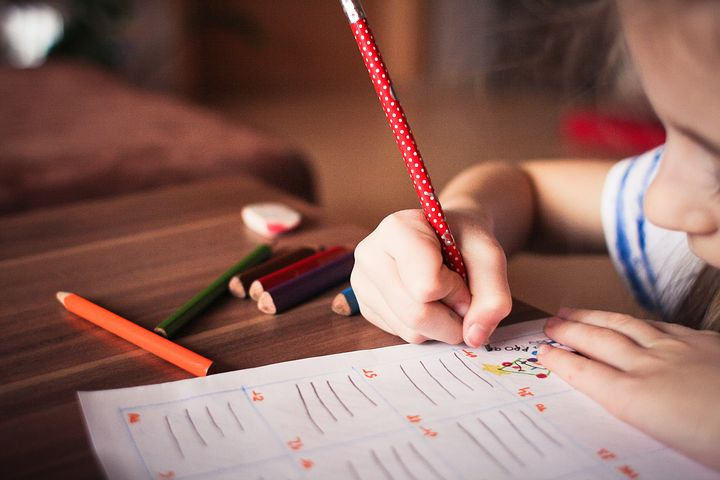

# Cómo se desarrolla en el niño

_Imagen tomada de Pixabay_

El desarrollo del proceso atencional es especialmente relevante debido a su implicación en el desarrollo adecuado de otras funciones cognitivas. Su funcionamiento está implicado en procesos tan necesarios para el desarrollo integral del niño como son los procesos perceptivos, el funcionamiento ejecutivo, la memoria, la motivación, el lenguaje… de tal manera que un desarrollo inadecuado de la atención dará lugar a la posible aparición de dificultades de aprendizaje (Sirumal, 2016).

#### Primer año

*   Siguen la mirada de otra persona
*   Dirigen su atención hacia el objeto que mira otra persona
*   Preferencia por estímulos con brillo, colores fuertes, contrastes, sonidos, movimiento y de cierta complejidad
*   Cuando se habitúan a un estímulo, pierden el interés

#### 1-3 años

*   Centran la atención en las características más notables (color, forma…) de los objetos o personas, aunque no sean las más informativas
*   Su atención, en esta etapa y en la siguiente, está condicionada por:
    *   El contexto (tipo de tarea, hora del día, presencia del adulto, clima del grupo…)
    *   Características personales (cómo percibe la dificultad de la tarea, motivación hacia la tarea…)

#### 3-5 años

*   Aumento de la atención sostenida. Al inicio de esta etapa, tienden a estar más atentos a medida que la sesión o tarea avanza
*   Centran mejor la atención en las aspectos relevantes de la tarea y van ignorando los aspectos irrelevantes, aunque aún cometen errores
*   Al final de esta etapa, son capaces de realizar una tarea atencional visual durante 15 minutos

#### 6-9 años

*   Incremento de la atención sostenida en una misma tarea
*   Empiezan a utilizar estrategias para mantener la atención (ej. Taparse los oídos mientras leen)
*   Pueden planificar su atención, por ejemplo, siguiendo una secuencia en la búsqueda de un objeto

#### 9-12 años

*   Mejora de la atención selectiva