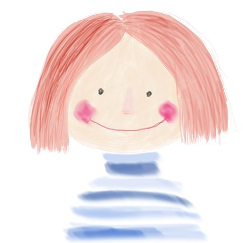

# Cómo se desarrolla en el niño

El desarrollo de las habilidades visoespaciales, visoperceptivas y visomotoras en el niño es el resultado de la integración paulatina del manejo del espacio, de la forma y del control motor. Cuando todas estas habilidades se unifican y pueden trabajar juntas es cuando el niño es capaz de crear mapas mentales e integrar los elementos que percibe en un todo organizado, lo que le permite acercarse a comprender la realidad que le rodea (Roselli, 2015).

Estas habilidades aparecen y se desarrollan en los primeros años de vida, siendo uno de los procesos que el niño va a ser capaz de manejar completamente más pronto en su período evolutivo. Tal y como veremos, durante el primer mes de vida se producirán grandes avances que permitirán que se desarrolle este proceso, terminando su desarrollo aproximadamente a los 12 años.

  
El desarrollo evolutivo de las habilidades visoespaciales, visoperceptivas y visomotoras:

### **Primer año de vida**

*   En los 2 primeros meses de vida, tanto sus actos como el seguimiento visual que realiza son todavía automáticos.
    
*   A los 2 meses discrimina los colores básicos
    
*   A los 3 meses y medio adquiere la visión estereoscópica de un objeto inmóvil
    
*   A los 3 meses y medio aparece la visión binocular y sigue desarrollándose hasta los 11 meses aproximadamente.
    
*   A los 3 meses inicia un cierto control voluntario de la mirada.
    
*   A los 3 meses también aparece un cierto control intencional del movimiento de las extremidades superiores. Aquí ya empieza a intentar agarrar objetos.
    
*   De los 4 a los 6 meses consigue el agarre de manera exitosa.
    
*   A los 6 meses ya maneja la acomodación, la agudeza visual y la sensibilidad al contraste.
    
*   A los 6 meses el niño ya ha desarrollado la capacidad de percibir la profundidad.
    
*   A los 6 meses inicia los movimientos coordinados bimanuales: es capaz de explorar objetos que se le ponen en una mano y transferirlos a la otra.
    
*   De los 6 a los 8 meses desarrolla la capacidad de agarre a través de la experiencia.
    
*   A partir de los 8 meses desarrolla la prensión manual y es capaz de coger objetos pequeños. Para ello utiliza de manera controlada el pulgar y el índice.
    

### **Del año a los 2 años**

*   Aproximadamente a los 18 meses se observa un uso preferente de una mano, aunque todavía no se ha producido la lateralización.
    
*   Entre los 12 y los 18 meses empieza a construir torres con cubos.
    
*   Entre los 8 y 14 meses ya se distingue en el niño una percepción de las relaciones espaciales, lo que le permite moverse en el ambiente con seguridad y eficacia.
    
*   A los 18 meses muestra mejores movimientos coordinados bimanuales.
    
*   Durante este período mejora de la organización espacial y su precisión motora.
    

### **De los 3 años a los 6 años**

*   Entre los 2 y los 3 años puede haber un período de inestabilidad respecto a la lateralidad, pudiendo aparecer un predominio bilateral.
    
*   Entre los 2 y los 5 años el niño mejora el control de los movimientos oculares.
    
*   A los 3 años se ve una clara asimetría manual para tareas construccionales y gráficas
    
*   Entre los 3 y 4 años puede aprender extremos direccionales como alto/bajo, encima/debajo y delante/detrás.
    
*   Entre los 3 y 4 años distingue posiciones horizontales y verticales, pero todavía tiene problemas con las líneas oblicuas y diagonales.
    
*   A los 4 años se establece la lateralidad, aunque seguirá en desarrollo pudiendo aparecer períodos de inestabilidad.
    
*   Entre los 5 y 6 años empieza a diferenciar la izquierda de la derecha en su propio cuerpo.
    
*   Entre los 4 y los 6 años mejora en la percepción de la figura y el fondo.
    

### **De los 7 años a los 11 años**

*   A los 8 años queda consolidada la lateralidad.
    
*   A partir de los 8 años se considera que el niño ha adquirido completamente la capacidad de percibir figura-fondo.
    
*   A los 8 años ya maneja perfectamente la percepción de líneas oblicuas y diagonales.
    
*   A los 10 años ya puede seguir con completa precisión objetos en movimiento.
    
*   A los 10 años se empieza a establecer la capacidad para leer mapas.
    
*   A los 8 años ya está adquirida la distinción derecha-izquierda
    
*   A los 11 años ya ha desarrollado completamente la constancia del tamaño. Hasta esta edad el niño tiende a sobreestimar el espacio entre dos objetos, a medida que se aleja de los objetos.
    
*   A los 12 años la habilidad para percibir un objeto en movimiento y movernos en respuesta a él está bien establecida.
    
*   Las habilidades visoperceptivas, visomotoras y visoespaciales alcanzan niveles adultos a los 12 años.