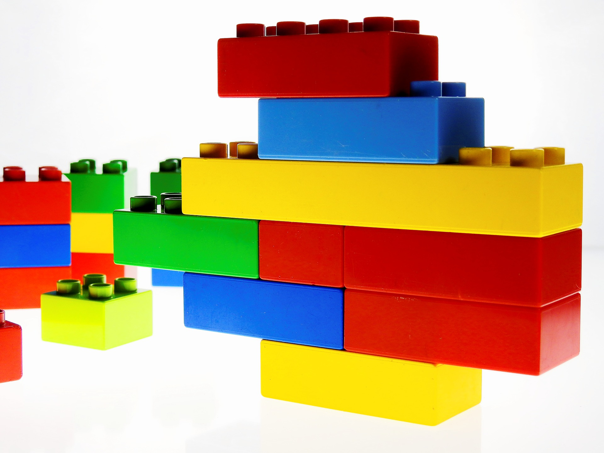

# Cómo se desarrolla en el niño

_Imagen tomada de Pixabay_

Tal y como hemos visto, las funciones ejecutivas constituyen un grupo de habilidades cognitivas que nos permiten adaptarnos a situaciones novedosas y complejas, permitiéndonos crear conductas no habituales en nuestro repertorio (Roselli, Matute y Jurado, 2008). Esta adquisición de una conducta más adaptada a las necesidades del medio, se irá mostrando a lo largo del desarrollo del niño, de manera que durante el crecimiento observaremos una mayor capacidad de controlar por sí mismos sus pensamientos, acciones y regulación de su propia conducta. Esta maduración en su forma de actuar y pensar se deberá en gran medida al mejor manejo de sus funciones ejecutivas (Bausela, 2014). 

Como veremos a continuación, el desarrollo de las funciones ejecutivas se producirá lentamente a lo largo del desarrollo del niño, llegando a obtener una maduración completa al final de la adolescencia y/o al inicio de la edad adulta. El modo en el que se desarrollarán será jerárquico y discontinuo, de manera que aspectos como la memoria operativa o el control atencional se desarrollarán en los primeros años de vida, mientras que funciones como la flexibilidad cognitiva o la capacidad de planificación empezarán a desarrollarse más tarde y terminarán de hacerlo en la adolescencia o, incluso, en las primeras etapas de la vida adulta.

####   
Primer año de vida

*   A los 4 meses de vida el niño tiene consciencia de la permanencia del objeto.
    
*   Entre los 8 y 12 meses de vida es capaz de usar el conocimiento acerca de la permanencia de los objetos para dirigir su conducta a una meta.
    
*   A los 9 meses de vida muestra respuestas automáticas ante estímulos ambientales.
    

#### Del primer año al segundo año

*   Con 1 año comienza a inhibir los estímulos irrelevantes
    
*   Con 1 año es capaz de inhibir una respuesta automática
    
*   A los 2 años, ha mejorado notablemente el manejo de su memoria operativa, lo que le permite actuar más eficazmente en el medio.
    

#### De los 3 a los 6 años

*   A los 4 años inicia la capacidad de planificar, aunque de un modo muy rudimentario.
    
*   A partir de los 3 años mejora considerablemente su capacidad inhibitoria, pero todavía presenta respuestas instintivas o automáticas
    
*   Mejora el funcionamiento de su memoria operativa
    
*   Desarrolla la capacidad de solucionar problemas, utilizando estrategias metacognitivas.
    
*   A los 6 años aparece establecida la inhibición conductual
    
*   Durante este período empieza a aparecer la flexibilidad cognitiva
    

#### De los 7 a los 11 años

*   Mejora el manejo de su memoria operativa
    
*   Entre los 9 y los 13 años mejora notablemente su capacidad de planificación
    
*   Entre los 7 y los 10 años se desarrolla por completo la capacidad de categorizar
    
*   Aproximadamente a los 9 años se establece la metacognición y la regulación conductual
    
*   A los 10 años adquiere una capacidad para seguir reglas en tareas de clasificación y para cambiar de una categoría equivalente a la de un adulto
    

####  De los 12 a los 16 años

*   Alcanza el manejo completo de la memoria operativa
    
*   Mejora considerablemente en su capacidad de planificar
    

#### De los 16 años a la vida adulta

*   Sigue mejorando su capacidad de planificar y organizar. Se considera que seguirá mejorando durante toda la segunda década de vida
    
*   La fluidez verbal (fonológica y semántica) adquiere su máximo desarrollo después de la adolescencia