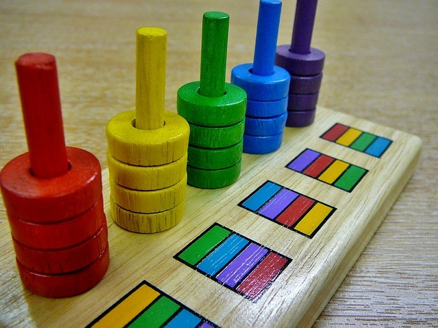

# Cómo y cuándo se trabajan en el aula

_Imagen tomada de Pixabay_

  
Tal y como hemos visto, las funciones ejecutivas abarcan diversas capacidades fundamentales para el adecuado desempeño escolar, no solo desde el punto de vista académico, sino en el desarrollo global de los alumnos.

Al igual que sucede con la atención, debemos tener muy en cuenta la capacidad cognitiva de nuestros alumnos para trabajarlas en el aula, ya que su desarrollo completo se sitúa al final de la adolescencia o inicio de la vida adulta.

No obstante, podemos llevar a cabo actividades globales que promuevan su desarrollo a través de diferentes tipos de tareas.  
  

*   **Inhibición de respuestas y control emocional  
    **Directamente ligada al control de la conducta, se debe trabajar especialmente durante la etapa de educación infantil aunque se deberá insistir en su relevancia a lo largo de las etapas educativas posteriores. La diferencia es que con los niños más pequeños alternaremos la instrucción directa (estableciendo normas de convivencia en el aula) con el juego.

*   Juegos de roles o simulación social.
    
*   Actividades que impliquen demora en la respuesta.
    
*   Actividades que permitan no obtener siempre lo que se desea.  
      
    

*   **Flexibilidad cognitiva   
    **Se trabaja a través de actividades que potencian la capacidad para considerar la existencia de más de una respuesta válida, así como la capacidad de ajustar los objetivos a cambios inesperados.

*   Actividades con más de una respuesta correcta.
    
*   Debates que requieran adoptar posiciones contrarias.
    
*   Problemas prácticos que requieran adaptarse a las respuestas de los demás.  
      
    

*   **Memoria operativa**   
    Implica mantener la información que se está recibiendo e integrarla progresivamente para conseguir el objetivo de la tarea. Igualmente, se utiliza en tareas que requieran realizar operaciones mentales con la información.

*   Comprensión de secuencias temporales (presentadas escritas o de forma oral).
    
*   Comprensión de instrucciones para elaborar algo.
    
*   Juegos de cálculo mental.  
      
    

*   **Planificación/priorización**   
    Implica establecer un orden tanto entre varias tareas como dentro de cada una de ellas.

*   Utilización de agendas o calendarios.
    
*   Secuenciar los pasos a seguir para lograr un objetivo.  
      
    

*   **Metacognición   
    **Implica desarrollar habilidades para supervisar las tareas y valorar la consecución de logros.

*   Actividades con tiempo limitado para su realización.
    
*   Utilización de _cheklist_ parta comprobar los logros alcanzados.