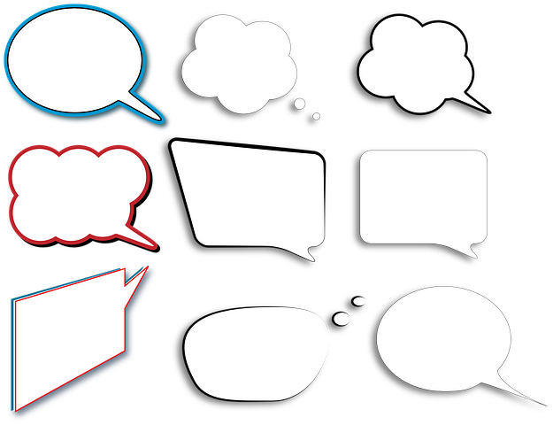

# COMENTARIOS FINALES

Como hemos visto hasta ahora, comprender el lenguaje implica una serie de procesos mentales cuya identificación y descripción resultan muy complejos. Si concretamos y hacemos referencia al lenguaje escrito, en términos de lectura, de escritura, y cálculo, se complica aún más, ya que no se hace referencia sólo a procesos de adquisición sino a procesos de comprensión, elaboración o procesamiento, es decir, a enfoques tanto conductuales como cognitivos. El lenguaje así descrito constituye un vehículo de transmisión y de adquisición de conocimientos y experiencias, que nos permite relacionarnos con el mundo exterior, académica, personal y socialmente.

Puede ocurrir, como hemos analizado anteriormente, que nuestros alumnos presenten algún problema en los procesos implicados, llevando en situaciones extremas a hablar de dificultades de aprendizaje. A pesar de los muchos especialistas que trabajan en el tema es un término difícil de definir por su variabilidad, pero donde sí parecen ponerse de acuerdo es en la tipología. Así, hablamos de dificultades en lectura, escritura y cálculo; esto es dificultades en los aprendizajes instrumentales básicos.  
  

En el siguiente bloque analizaremos cada una de estas dificultades de aprendizaje así como su evolución.

## Para reflexión:

¿Recuerdas la actividad de reflexión que planteamos al inicio de los procesos?

Recupera lo que escribiste acerca de los conocimientos que tenían que tener tus alumnos para responder (lenguaje verbal) o redactar (lenguaje escrito) una pregunta sencilla relacionada con la actividad propuesta.

Ahora, contrástalo con lo que hemos visto.

¿Hay muchas diferencias? ¿Dónde se encuentran esas diferencias?