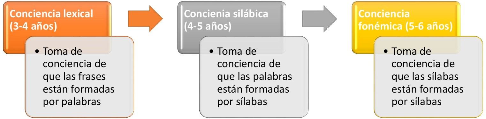

# Cuál es el desarrollo normal de estos procesos

El desarrollo de la **percepción del lenguaje** en el niño empieza ya en el útero de la madre, de esta manera se establecen los siguientes hitos evolutivos:

*   Desde el 7º mes del embarazo, la corteza auditiva es funcional, de manera que los fetos pueden reaccionar tanto al sonido interno como externo.
    
*   Desde el 7º mes de gestación al 6º mes de vida empiezan a desarrollar las claves de la entonación y el ritmo.
    
*   Desde el 6ª mes al primer año de vida empieza la especialización fonológica de los sonidos de su lengua materna (vocales a los 5-6 meses y consonantes a los 10 meses).
    

  

  
El aspecto más relevante en la adquisición de una correcta percepción del lenguaje, será el desarrollo de la **conciencia fonológica**, aunque establecer el momento evolutivo en que emergen las habilidades metalingüísticas necesarias para su desarrollo constituye una tarea complicada. Por un lado, no hay establecido un consenso al respecto y, por otro, no todas las habilidades siguen el mismo ritmo de adquisición ni exigen la misma demanda cognitiva. 

De esta manera, la conciencia fonológica se manifiesta en niveles de complejidad creciente a través de la edad, en base a dos grandes dimensiones: la complejidad lingüística y las operaciones cognitivas necesarias para su adquisición. Respecto a la primera dimensión (complejidad lingüística), el desarrollo implica una toma de conciencia de unidades de sonido inicialmente más grandes y concretas hasta unidades cada vez más pequeñas y abstractas. Respecto a la segunda de las dimensiones (operaciones cognitivas), el desarrollo se caracteriza por un avance desde operaciones simples -como distinguir sonidos diferentes hasta omitir o agregar unidades fonológicas- y en grado creciente de complejidad. En consecuencia, la conciencia fonológica se adquiere paulatinamente, de manera que primero aparecerá la capacidad para manipular las palabras, luego las sílabas y, por último, los fonemas. En la imagen que aparece a continuación, puedes ver un pequeño esquema acerca de cómo se produce la adquisición de la conciencia fonológica.   
  
  

  
  
Para entender todo este proceso de manera más concreta, recordemos que en el español se han señalado tradicionalmente dos unidades fonológicas: la sílaba y el fonema. La sílaba es la unidad que puede ser percibida directamente y producida en forma aislada, lo cual favorece que el niño se dé cuenta de su existencia más fácilmente. En cambio, las características acústicas propias de cada fonema, especialmente los consonánticos, se alteran obstaculizando la percepción aislada de ellos, lo que dificulta que los niños tomen conciencia de su existencia. Es a causa de estas características que el niño desarrolla primero la conciencia silábica, habilidad que posteriormente le permite tomar conciencia de que existen los fonemas, hecho fundamental para la adquisición de la lectoescritura.

La habilidad para segmentar en palabras y sílabas, para la producción y detección de rimas o sonidos iniciales y finales de las palabras, se desarrollan previamente a la lectura y facilitan su aprendizaje, no obstante, la consolidación de la toma de conciencia y manipulación de los fonemas se desarrolla junto con este aprendizaje.