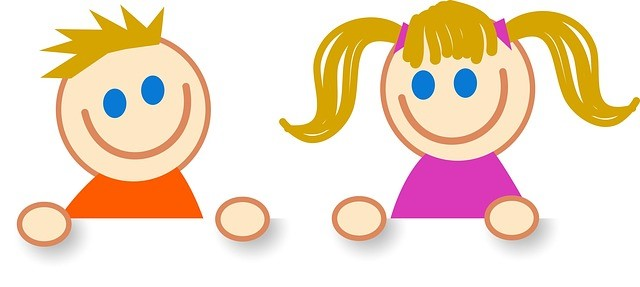

# Cuál es el desarrollo normal de estos procesos

El lenguaje requiere de un procesamiento cognitivo complejo que va a necesitas contar con la presencia de otras habilidades cognitivas tales como el procesamiento de la información auditiva, la memoria o la atención, entre otras.

Para comprender su desarrollo a nivel sintáctico-semántico, será conveniente conocer también cómo se desarrolla en el niño la morfología del lenguaje. A continuación, analizamos de manera separada cómo se desarrolla en el niño el lenguaje en estos 3 niveles: Semántico, Morfológico, Sintáctico.

## Desarrollo semántico

En cuanto al desarrollo semántico (del léxico) distinguimos los periodos entre 0 a 10 palabras; entre 10 y 50 palabras; a partir de 50 palabras; a partir de los 2 años; a partir de los 5 años.

**_De 0 a 10 palabras:_**

*   Éstas aparecen en contextos determinados y rutinarios. Los niños no son capaces de generalizar el uso de las palabras a otros referentes “iguales”.  
      
    

**_De 10 a 50 palabras_**:

*   El progreso en la adquisición es lento y las nuevas palabras están descontextualizadas.
*   Aquí, además, suelen producirse dos errores: infraextensión, se limita el uso de una palabra a un ejemplar prototípico; o sobreextensión o sobregeneralización, que es el empleo de una misma palabra para designar “objetos” con características similares.
*   En el aprendizaje de nuevas palabras los niños van formando campos semánticos (grupos de palabras que tienen alguna relación semántica entre sí). La mayor parte de grupos semánticos se refieren a personas, animales, alimentos,… Más o menos todos los niños no siguen el mismo proceso de adquisición.
*   El tipo de vocabulario utilizado por los niños es referencial (nombres comunes) y menos palabras con función gramatical y de uso personal y expresivo (palabras con función gramatical, como son las preposiciones, pronombres –yo, mío, ese, qué quién…- y de uso personal-social para relacionarse –hola, adiós…- y expresar sentimientos –si, no, quiero…-)  
      
    

**_A partir de 50 palabras_** hay una explosión de vocabulario y un salto tanto cuantitativo como cualitativo.

*   En torno a los 18 y 24 meses, el proceso de adquisición del significado de las palabras necesita de algún tipo de capacidad o predisposición que lo guíe. Las restricciones o principios que guían este proceso son:
    *   Restricción del objeto completo: una palabra desconocida tiende a referirla a todo el objeto.
    *   Restricción taxonómica: tendencia a referir las nuevas palabras a objetos de la misma clase (p.ej: Utilizar la palabra autobús para nombrar otros vehículos)
    *   Restricción de la mutua exclusividad: una nueva palabra para un mismo objeto, se atribuye a una cualidad de ese objeto (no puede haber dos nombres para un mismo objeto).  
          
        

**A partir de los _dos años_** hay un avance vertiginoso relacionado con la categorización y conceptualización de la realidad.  Los niños van conformando campos semánticos más complejos, como es el caso de los adjetivos dimensionales (grande/pequeño; más adelante, largo/corto,…), la longitud de las oraciones y modo de combinar palabras y frases para formar oraciones (sintaxis). Varias características definen esta evolución (Berger y Thompson, 2007):

*   _Adquisición rápida de palabras mediante mapas conceptuales:_ en esta edad se entienden unas 14.000 palabras, esto es, cada día se adquieren unas 9 palabras. Esta velocidad de adquisición se debe a la elaboración de mapas conceptuales que permiten aportar significado a una nueva palabra después de solamente haberla oído una o dos veces.
*   _Diferenciación de vocabulario oído y vocabulario hablado:_ el léxico potencial de comprensión es más amplio que el vocabulario hablado. Además, la capacidad de comprensión depende de los propios intereses infantiles.
*   _Habla privada, habla social y pragmática:_ los niños emplean el habla privada como un discurso que se dirigen a sí mismos y que puede servir como guía para la conducta e, igualmente, como entrenamiento de las habilidades propias de la conversación, esto es, la pragmática. La pragmática es el aspecto del lenguaje relacionado con la comunicación efectiva con los demás (respetar turno, ceñirse a un tema, etc.). Con el desarrollo de estas habilidades se incrementa el uso de habla social, o discurso dirigido a otra persona para ser entendido.

Tal y como veremos a continuación, en su producción sintáctica, los niños alrededor de los dos-tres años logran establecer el predicado nominal, ya que usan las formas diferenciadas de los artículos: posesivos, demostrativos o indefinidos. Al poco tiempo, emplean los pronombres personales con funciones de sujeto y de complemento de los verbos. Alrededor de los tres-cuatro años comienzan a producir las oraciones interrogativas con pronombres. La variación en la morfología verbal aumenta al comienzo de este período en cuanto a tiempo, aspecto y modo. Aparece la concordancia de número, persona y verbo, y las oraciones complejas, primero las coordinadas y después, alrededor de los seis años, las subordinadas. Las pasivas, ya sean irreversibles _(las flores fueron regaladas por María_) o y las reversibles (_el coche es empujado por el tractor)_ a lo largo de Educación Primaria.

A lo largo de este período, los niños adquieren los denominados _géneros discursivos_ (organización del habla que sigue un determinado esquema). Las oraciones que producen tienen intencionalidad en la medida en que pretenden conversar, argumentar, dar explicaciones, etc. (Palacios, Marchesi y Coll, 2000).  
  

**Desde** **_los 5 años_** aparecen los términos supraordinados y subordinados, en relación con el término básico (por ejemplo, animal, perro, pastor alemán).  Poco después los sinónimos y antónimos. Comienza el desarrollo metafonológico. A partir de este momento los niños empiezan a ser conscientes de las diferencias que suponen los cambios en ciertos sonidos (pato/gato) y de la estructura fonológica de las palabras (sílabas). Además, esta conciencia fonológica se encuentra muy estimulada por las actividades de lectura y escritura que se realizan. Al final de este período, los niños son capaces de reproducir las consonantes y las 7 combinaciones de consonantes y vocales, salvo, por ejemplo, los diptongos o sinfones, o las consonantes_ l, r, s, z _(dando lugar a la denominada dislalia evolutiva).

## Desarrollo morfológico

Antes de ver cómo se desarrolla el proceso sintáctico, es conveniente abordar el desarrollo morfológico. Las **_etapas en la adquisición de los primeros morfemas_**, según Palacios, Marchesi y Coll (2004) es la siguiente:

**18-24 meses**

*   Formas no diferenciadas de los primeros artículos.
*   Primeras formas del plural usadas no sistemáticamente.
*   Primeras formas del artículo determinado e indeterminado.
*   Uso de algunas preposiciones.
*   Uso no diferenciado de los diminutivos.
*   Uso anecdótico de los pronombres posesivos.  
      
    

**24-36 meses**

*   Uso sistemático de los plurales en nombres, adjetivos, determinantes.
*   Variación adecuada en los determinantes.
*   Primeras variaciones en los verbos en tiempo y persona.
*   Variación del género.
*   Mayor variedad en proposiciones y adverbios.
*   Uso diferenciado de los adverbios y preposiciones de lugar.
*   Uso de auxiliares (ser/estar).
*   Uso sistemático de pronombres personales y posesivos.
*   Aparición del modo (sujetivo).
*   Aparición de los tiempos compuestos.
*   Errores de sobreregularización (se ha rompido).  
      
    

**De 36 a 48 meses**

*   Uso sistemático de los tiempos, persona y modo verbales.
*   Uso de los aumentativos y diminutivos.
*   Uso frecuente de adverbios, pronombres, preposiciones.
*   Errores de sobrerregularización que desaparecerán a los 6 años.

## Desarrollo sintáctico

De manera detallada, en el **_desarrollo sintáctico_** podemos distinguir las siguientes etapas:

**12 meses:**

*   Las primeras producciones no revelan conocimiento gramatical (1 palabra o frases hechas)  
      
    

**18 meses:**

*   Comienzan las primeras combinaciones de 2 y más palabras. Las combinaciones de 3 palabras combinan relaciones semánticas (agente-acción-objeto).
*   Comienzan a formar la categoría nominal: VOCAL (que hace la función de artículo) + NOMBRE.
*   Al final, uso correcto de artículos esporádicamente.  
      
    

**2 a 2 y1/2 años:**

*   Oraciones simples, pero completas.
*   Dominio de la concordancia de número.
*   Categoría nominal: DETERMINANTES (artículos, posesivos, demostrativos…) + NOMBRE.
*   Oraciones negativas e interrogativas simples.  
      
    

**2 y1/2 a 3 años.**

*   Dominio de la concordancia de género.
*   Categoría verbal (conjugación de los verbos).
*   Dominio de la morfología verbal y nominal.
*   Oraciones interrogativas con pronombre (¿qué es eso? ¿de quién es…?).
*   Primeras oraciones coordinadas (y, o, ni, pero, luego, sino...) y subordinadas (que).  
      
    

**3 a 4 y1/2 años.**

*   Dominio de la selección del modo (indicativo/subjuntivo).
*   Uso de todas las oraciones subordinadas (porque, aunque, para, mientras, si).
*   Control de la corrección gramatical.

_  
  
Tabla. Desarrollo sintáctico en la adquisición del lenguaje. Tomado de Tomado de García-Sánchez, J. N. (Coord.) (2007)_

<tbody>
<tr>
<td width="81" valign="top">

<strong><em>Años</em></strong>

</td>
<td width="469" valign="top">

<strong><em>Características</em></strong>

</td>
</tr>
<tr>
<td width="81" valign="top">

<strong>4-7 años</strong>

</td>
<td width="469" valign="top">

Dominio de las flexiones de género y número (a los 5 años, el género en nombres y pronombres, y a los 7 años, el número). Mejora de los tiempos verbales pero todavía confunden subjuntivo y condicional. Aparece la sintaxis compleja aunque no siempre los verbos están bien ajustados. Uso correcto de preposiciones y conjunciones, artículos definidos e indefinidos y adjetivos y pronombres deícticos.

</td>
</tr>
<tr>
<td width="81" valign="top">

<strong>7-11 años</strong>

</td>
<td width="469" valign="top">

Dominio completo de la sintaxis compleja. Manejan la concordancia de artículos y pronombres cuando la referencia es anafórica. Se matiza la diferencia entre tiempos verbales y comprenden y distinguen el condicional y el subjuntivo. Producen bien los verbos deícticos. Comprensión de oraciones pasivas irreversibles (ej. “El jarrón es roto por la piedra”) y posteriormente reversibles (ej. “El chico se deja lavar por la chica”). Comprensión de oraciones que vulneran el orden estándar y otras oraciones complejas. Elaboración básica del discurso conectado. Géneros discursivos (organizando el habla según un esquema determinado): conversar, relatar, explicar…

</td>
</tr>
<tr>
<td width="550" valign="top" colspan="2">

Tomado de García-Sánchez, J. N. (Coord.) (2007):&nbsp; «Evaluación e intervención en los trastornos del lenguaje expresivo»,&nbsp; en&nbsp;<i>Dificultades del desarrollo. Evaluación e intervención</i>. Madrid: Pirámide.

</td>
</tr>
</tbody>

**_Años_**

**_Características_**

**4-7 años**

Dominio de las flexiones de género y número (a los 5 años, el género en nombres y pronombres, y a los 7 años, el número). Mejora de los tiempos verbales pero todavía confunden subjuntivo y condicional. Aparece la sintaxis compleja aunque no siempre los verbos están bien ajustados. Uso correcto de preposiciones y conjunciones, artículos definidos e indefinidos y adjetivos y pronombres deícticos.

**7-11 años**

Dominio completo de la sintaxis compleja. Manejan la concordancia de artículos y pronombres cuando la referencia es anafórica. Se matiza la diferencia entre tiempos verbales y comprenden y distinguen el condicional y el subjuntivo. Producen bien los verbos deícticos. Comprensión de oraciones pasivas irreversibles (ej. “El jarrón es roto por la piedra”) y posteriormente reversibles (ej. “El chico se deja lavar por la chica”). Comprensión de oraciones que vulneran el orden estándar y otras oraciones complejas. Elaboración básica del discurso conectado. Géneros discursivos (organizando el habla según un esquema determinado): conversar, relatar, explicar…

Tomado de García-Sánchez, J. N. (Coord.) (2007):   
«Evaluación e intervención en los trastornos del lenguaje expresivo»,   
en _Dificultades del desarrollo. Evaluación e intervención_. Madrid: Pirámide.