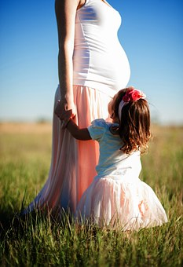

# Cuál es el desarrollo normal de estos procesos

# Desarrollo de la pragmática

_Imagen tomada de Pixabay_

El contexto social desempeña un rol fundamental en el aprendizaje de las locuciones tempranas, proporcionando la estructura y contenido de éstas. Los factores situacionales, que a veces condicionan qué es lo que puede decir el niño, incluyen objetos, actividades y personas de la acción comunicativa, así como otras variables conversacionales. También, los factores internos del niño, que incluyen su percepción de la situación, influyen en las primeras locuciones. En esta etapa inicial del desarrollo lingüístico, el niño comunica más de lo que puede codificar, lo cual se demuestra en la capacidad de los adultos de adivinar el mensaje que pretende enviar el niño. En general, desde la pragmática se considera que la tarea del niño es aprender cómo determina su comunidad lingüística el **uso del lenguaje**. 

Desde el enfoque pragmático, el desarrollo del lenguaje involucra un complejo interjuego de emergencia de habilidades de dominios social-afectivos, comunicativos, cognitivos y lingüísticos.

Basándose en la teoría de actos de habla, Bates, Camaioni y Volterra describen tres estadios que dan cuenta de la adquisición de habilidades comunicativas pragmáticas básicas.

*   El primer estadio, llamado **_Fase Perlocutiva_** se presenta antes de los diez meses de edad, incluye aquellos actos comunicativos que tienen efecto en el oyente, sin el propósito de hacerlo.
    
*   El segundo estadio o **_Fase Ilocutiva_** comprende el periodo que va desde los diez a los doce meses. En esta etapa, el niño comienza a usar, en forma intencional, gestos y 60 vocalizaciones no lingüísticas para afectar la conducta del oyente.
    
*   El tercer estadio, _**Fase Locutiva**_, está presente a partir de los doce meses, cuando el niño comienza a expresar verbalmente sus intenciones.
    

  
  
Al igual que ocurría con los procesos anteriores, la pragmática (aplicación práctica del conocimiento lingüístico) manifiesta un progreso igualmente importante. Algunos de estos avances se refieren a la permanencia en un tema durante una conversación, adaptar el contenido y forma a la persona con la que se interacciona (conocido vs. desconocido), modificar el habla en función de características del contexto, etc. Uno de los avances más estudiados es el **cambio de código** según la persona con la que se interaccione. Un cambio de código consiste en modificar la forma de hablar (incluyendo tonos, gestos, pronunciación, longitud de las oraciones y vocabulario) en función de alguna circunstancia contextual. Los niños emplean un código formal en el colegio o con adultos; mientras que emplea un código informal con los amigos. El paso de uno a otro, según cambien las características del contexto, es un claro indicador de sofisticación lingüística. Las características de ambos son:

*   El **_código formal_**  **_o elaborado_** se caracteriza por un vocabulario amplio, una sintaxis compleja y frases largas, propio del aula (Palacios, Marchesi y Coll, 2004).
    
*   El **_código informal_**  **_o restringido_** consiste en un vocabulario limitado, igual que la sintaxis, mayor apoyo en los gestos, en la entonación y en la experiencia compartida; es más informal, abreviado, coloquial y está ligado al contexto (Palacios, Marchesi y Coll, 2004).
    

Otro de los avances en la pragmática en el lenguaje es la **redacción de textos.** Componer implica poner en funcionamiento diversos conocimientos agrupados en dos tipos de variables: Las variables internas (esto es, conocimientos previos del tema sobre el que se desea escribir y habilidades escritoras, que corresponderían a los procesos vistos anteriormente) y las variables externas (contexto comunicativo y tipo de audiencia) (Cassany, 2000). Los niños avanzan progresivamente en la elaboración de textos desde esta perspectiva, adquiriendo un desarrollo completo -en términos de la inclusión de las variables anteriormente mencionadas- al inicio de la adolescencia.  

Uno de los modelos más utilizados en esta pragmática del lenguaje es el de Flower y Hayes (1980, 1981). Está formado por tres procesos: planificación, traducción o transcripción y revisión.

*   La _planificación_ es el proceso mediante el cual los escritores se forman una representación mental de la información que contendrá el texto. Se intenta responder a las preguntas: ¿_Cuál es el objetivo de mi escrito? ¿Qué conocimientos poseo el tema? ¿A quién está dirigido? ¿Cómo voy a organizar la información?.  
    _
    
*   En la _traducción o transcripción_ se elaboran los distintos borradores que intentan responder a las preguntas planteadas en la planificación, hasta llegar al texto final. Por ejemplo: cuento, redacción, preguntas de un examen, comentario de un libro o una película, etc.
    
*   Por último, se lleva a cabo una r_evisión o evaluación_ para asegurar que las preguntas iniciales han sido respondidas: ¿_He conseguido realmente el objetivo previsto? ¿He recuperado todos los conocimientos previos que tenía acerca del tema? ¿Me he dirigido correctamente a la audiencia?,_ etc. De no ser así, se introducirían los cambios necesarios.
    

#   
Desarrollo del lenguaje matemático

Por último, algunos autores consideran que dentro del **lenguaje matemático** se pueden encontrar algunos aspectos relacionados con la pragmática del lenguaje. Por esta razón aprovechamos este apartado para aportar algunas pinceladas acerca de este concepto, elemento básico en la adquisición de la competencia matemática.

En el módulo 3, referido a las dificultades del aprendizaje, comentaremos más extensamente cómo se desarrolla la competencia vinculada a las matemáticas, así como cuáles son los problemas asociados con los que nos podemos encontrar en el aula. 

_  
Imagen tomada de Pixabay_  
  
El lenguaje empleado en las matemáticas difiere del lenguaje de la vida cotidiana, tanto en los aspectos explícitos como implícitos. Un aprendizaje comprensivo de las matemáticas implica que los alumnos conjeturen, realicen abstracciones no descontextualizadas de las propiedades matemáticas, que expliquen sus razonamientos, validen sus posiciones, etc.  (Lago y Rodríguez, 2000). En general, el lenguaje de las matemáticas alude al:

*   Lenguaje verbal  empleado en el aula de matemáticas
    
*   Utilización de determinadas palabras con fines matemáticos
    
*   Lenguaje de los textos (material verbal, gráfico, representacional, etc.)
    
*   Lenguaje de las formas simbólicas escritas
    
*   Lenguaje usado como apoyo por el alumno cuando está trabajando con las matemáticas (habla interna).
    

  
Estas funciones conllevan diversas actividades: leer, escribir, escuchar, discutir, etc. Uno de los problemas con el que se encuentran los alumnos, es establecer una cierta consistencia entre las diferentes representaciones y expresiones del mismo contenido matemático. Al principio, los niños piensan en el número y la aritmética de forma no verbal (fase de preconteo). Poco a poco, el uso de las habilidades de conteo se va extendiendo y desarrollando (fase de conteo), consiguiendo, por último, utilizar los símbolos escritos (fase de números escritos) (Núñez y Lozano, 2007). Veamos en qué consiste cada una de estas fases:

**1\. Fase de preconteo**

*   Antes de que los niños de Educación Infantil (primer ciclo) cuenten con exactitud una colección de objetos, ya son capaces de elaborar nociones básicas sobre el número y las operaciones de suma y resta e incluso de multiplicación y división. Se indica que muchas de estas competencias ya se hallan presentes en los bebés (Rodríguez, Lago, Caballero, Dopico y Solbes, 2008).
    
*   Alrededor de los 3 años pueden recordar y reproducir una colección oculta de 1 a 4 elementos sin haberla contado.
    
*   Ente los 3 y los 5 años indican correctamente el resultado de añadir o quitar un número pequeño de elementos a una colección que previamente han visto. Son capaces de resolver sencillos problemas no verbales de suma y resta cuando todavía no pueden resolver problemas verbales parecidos o expresiones numéricas escritas.
    
*   Entre los 4 y los 6 años empiezan a construir conceptos sobre las operaciones de multiplicación y división que implican agrupamientos o particiones de colecciones de objetos discretos. Utilizan al menos tres estrategias informales: recuento unitario, doble recuento (integran dos secuencias de conteo) y conteo de transición (calculan la respuesta utilizando una secuencia de conteo basada en múltiplos de un mismo factor) (Rodríguez _et al._ 2008).
    

**2\. Fase de conteo**

*   Los niños representan verbalmente los números mediante las palabras que utilizamos para contar. Probablemente, el preconteo no verbal y la competencia numérica y aritmética que de él se derivan, sirvan de base para el conocimiento aritmético y numérico posterior basado en lo verbal. El conocimiento matemático informal de los niños se amplía a partir del aprendizaje de las diferentes técnicas de conteo. A medida que van desarrollando la habilidad de contar, pueden tratar con colecciones mayores de 4 y aprenden a operar con esos números.

**3\. Fase de los números escritos**

*   Por último, los niños asimilan las representaciones escritas a su conocimiento informal del número y de la aritmética. El apoyo en el sistema numérico escrito permite pensar en números mayores y operar con ellos.