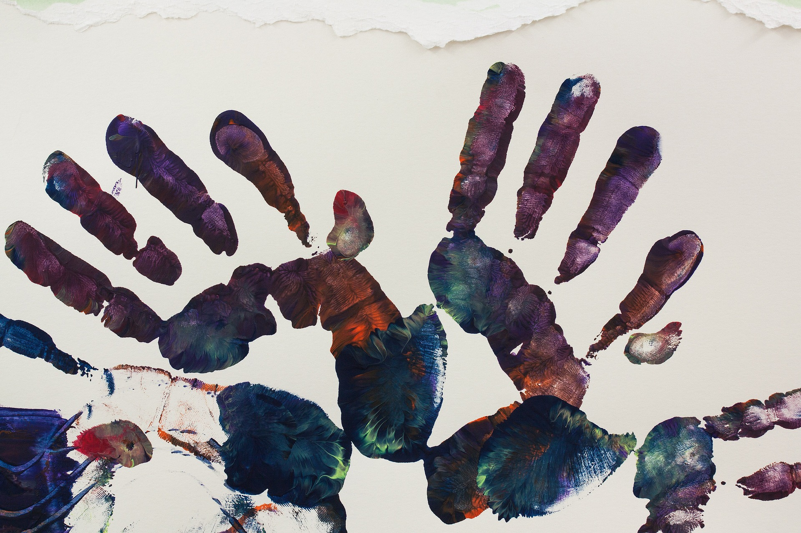

# Cuándo y cómo se trabaja en el aula

Tal y como hemos visto, las habilidades visoespaciales, visoperceptivas y visomotoras son básicas para la adquisición de otras capacidades más complejas, y consecuentemente de los aprendizajes básicos. Aunque se puedan mejorar las destrezas relacionadas con estas actividades a lo largo del desarrollo, la etapa clave para su adquisición será la de educación infantil. Por ese motivo, las actividades propuestas están enfocadas a esta etapa educativa. No obstante, todas ellas son perfectamente válidas en etapas educativas posteriores, incrementando la dificultad de las mismas.

Este tipo de actividades son fáciles de plantear como juegos, de manera que resultarán altamente motivadoras para los alumnos. Además, con su realización se estará reforzando la adquisición de habilidades atencionales, básicas para poder realizarlas de manera efectiva.

** Tareas visoespaciales:** requieren identificar posiciones de objetos o de uno mismo en el espacio.

*   Discriminación de la orientación espacial de objetos.
    
*   Discriminación de la posición de uno mismo respecto a un objeto.
    
*   Discriminación de la posición de uno mismo respecto a los demás.
    
*   Realización de laberintos.
    

** Tareas visoperceptivas:** altamente ligadas a las tareas de atención selectiva, requieren la discriminación de estímulos visuales.

*   Discriminación de dibujos superpuestos.
    
*   Búsqueda de elementos diferentes.
    
*   Clasificación de elementos con un criterio establecido.
    
*   Identificación de secuencias visuales.
    

** Tareas visomotoras:** requieren la coordinación óculo-motora, tanto respecto a destrezas gruesas como finas.

*   Imitación de gestos y/o movimientos de otros.
    
*   Realización de puzzles y construcciones.
    
*   Recorridos con obstáculos.
    
*   Realización de actividades relacionadas con la vida doméstica.