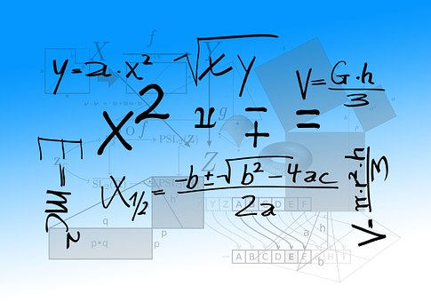

# Desarrollo del lenguaje matemático

Por último, algunos autores consideran que dentro del **lenguaje matemático** se pueden encontrar algunos aspectos relacionados con la pragmática del lenguaje. Por esta razón aprovechamos este apartado para aportar algunas pinceladas acerca de este concepto, elemento básico en la adquisición de la competencia matemática.

En el módulo 3, referido a las dificultades del aprendizaje, comentaremos más extensamente cómo se desarrolla la competencia vinculada a las matemáticas, así como cuáles son los problemas asociados con los que nos podemos encontrar en el aula. 

El lenguaje empleado en las matemáticas difiere del lenguaje de la vida cotidiana, tanto en los aspectos explícitos como implícitos. Un aprendizaje comprensivo de las matemáticas implica que los alumnos conjeturen, realicen abstracciones no descontextualizadas de las propiedades matemáticas, que expliquen sus razonamientos, validen sus posiciones, etc.  (Lago y Rodríguez, 2000). En general, el lenguaje de las matemáticas alude al:

* Lenguaje verbal  empleado en el aula de matemáticas
* Utilización de determinadas palabras con fines matemáticos
* Lenguaje de los textos (material verbal, gráfico, representacional, etc.)
* Lenguaje de las formas simbólicas escritas
* Lenguaje usado como apoyo por el alumno cuando está trabajando con las matemáticas (habla interna).

Estas funciones conllevan diversas actividades: leer, escribir, escuchar, discutir, etc. Uno de los problemas con el que se encuentran los alumnos, es establecer una cierta consistencia entre las diferentes representaciones y expresiones del mismo contenido matemático. Al principio, los niños piensan en el número y la aritmética de forma no verbal (fase de preconteo). Poco a poco, el uso de las habilidades de conteo se va extendiendo y desarrollando (fase de conteo), consiguiendo, por último, utilizar los símbolos escritos (fase de números escritos) (Núñez y Lozano, 2007). Veamos en qué consiste cada una de estas fases:

**1\. Fase de preconteo**

* Antes de que los niños de Educación Infantil (primer ciclo) cuenten con exactitud una colección de objetos, ya son capaces de elaborar nociones básicas sobre el número y las operaciones de suma y resta e incluso de multiplicación y división. Se indica que muchas de estas competencias ya se hallan presentes en los bebés (Rodríguez, Lago, Caballero, Dopico y Solbes, 2008).
* Alrededor de los 3 años pueden recordar y reproducir una colección oculta de 1 a 4 elementos sin haberla contado.
* Ente los 3 y los 5 años indican correctamente el resultado de añadir o quitar un número pequeño de elementos a una colección que previamente han visto. Son capaces de resolver sencillos problemas no verbales de suma y resta cuando todavía no pueden resolver problemas verbales parecidos o expresiones numéricas escritas.
* Entre los 4 y los 6 años empiezan a construir conceptos sobre las operaciones de multiplicación y división que implican agrupamientos o particiones de colecciones de objetos discretos. Utilizan al menos tres estrategias informales: recuento unitario, doble recuento (integran dos secuencias de conteo) y conteo de transición (calculan la respuesta utilizando una secuencia de conteo basada en múltiplos de un mismo factor) (Rodríguez _et al._ 2008).

**2\. Fase de conteo**

* Los niños representan verbalmente los números mediante las palabras que utilizamos para contar. Probablemente, el preconteo no verbal y la competencia numérica y aritmética que de él se derivan, sirvan de base para el conocimiento aritmético y numérico posterior basado en lo verbal. El conocimiento matemático informal de los niños se amplía a partir del aprendizaje de las diferentes técnicas de conteo. A medida que van desarrollando la habilidad de contar, pueden tratar con colecciones mayores de 4 y aprenden a operar con esos números.

**3\. Fase de los números escritos**

* Por último, los niños asimilan las representaciones escritas a su conocimiento informal del número y de la aritmética. El apoyo en el sistema numérico escrito permite pensar en números mayores y operar con ellos.