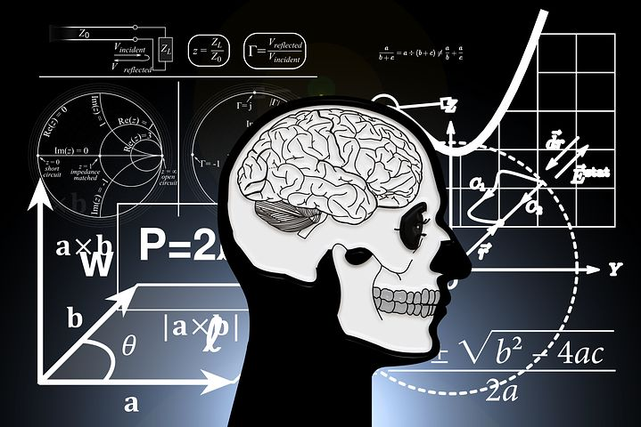

# DIFICULTADES EN LA COMPETENCIA MATEMÁTICA. LA DISCALCULIA

****

## **Para reflexión**

Piensa en la siguiente tarea: tus alumnos tienen que resolver un problema matemático

Ahora, por favor, piensa en todos los conocimientos que tienen que activar para poder resolverlo adecuadamente

Si los escribes, te resultará más sencillo identificarlos

**Ahora vamos a trabajar cada uno de esos conocimientos**

## **  
Aproximación conceptual a la competencia matemática**

_Imagen tomada de Pixabay_

  
La competencia matemática es una habilidad crucial que implica la capacidad de plantear, formular, resolver, e interpretar problemas empleando las matemáticas dentro de una variedad de situaciones y contextos. Estos contextos van desde los puramente matemáticos a aquellos que no presentan ninguna estructura matemática aparente (en este caso la persona debe introducir ella misma la estructura matemática). También es importante enfatizar que la definición no se refiere solamente a un nivel mínimo básico de conocimiento de las matemáticas. Al contrario, la definición atañe a la capacidad de utilizar las matemáticas en situaciones que van de lo cotidiano a lo inusual y de lo simple a lo complejo.

Dentro de las competencias matemáticas que los niños van aprendiendo a lo largo de su escolaridad se encuentran varios tipos (Provenza y Leyva, 2006):  

**Pensar y razonar. Incluye las capacidades de:**

*   Plantear cuestiones propias de las matemáticas (¿Cuántos hay? ¿Cómo encontrarlo? Si es así,… entonces, etc.).
    
*   Conocer los tipos de respuestas que ofrecen las matemáticas a estas cuestiones.
    
*   Distinguir entre diferentes tipos de enunciados (definiciones, teoremas, conjeturas, hipótesis, ejemplos, afirmaciones condicionadas).
    
*   Entender y utilizar los conceptos matemáticos en su extensión y sus límites.  
      
    

**Argumentar. Incluye las capacidades de:**

*   Conocer lo que son las pruebas matemáticas y cómo se diferencian de otros tipos de razonamiento matemático.
    
*   Seguir y valorar cadenas de argumentos matemáticos de diferentes tipos.
    
*   Disponer de sentido para la heurística (¿Qué puede (o no) ocurrir y por qué?).
    
*   Crear y expresar argumentos matemáticos.  
      
    

**Comunicar. Incluye las capacidades de:**

*   Expresarse en una variedad de vías, sobre temas de contenido matemático, de forma oral y también escrita.
    
*   Entender enunciados de otras personas sobre estas materias en forma oral y escrita.
    

**Modelar. Incluye las capacidades de:**

*   Estructurar el campo o situación que va a modelarse.
    
*   Traducir la realidad a una estructura matemática.
    
*   Interpretar los modelos matemáticos en términos reales.
    
*   Trabajar con un modelo matemático.
    
*   Reflexionar, analizar y ofrecer la crítica de un modelo y sus resultados.
    
*   Comunicar acerca de un modelo y de sus resultados (incluyendo sus limitaciones).
    
*   Dirigir y controlar el proceso de modelización.
    

**Plantear y resolver problemas. Incluye las capacidades de:**

*   Plantear, formular y definir diferentes tipos de problemas matemáticos (puros, aplicados, de respuesta abierta, cerrados).
    
*   Resolver diferentes tipos de problemas matemáticos mediante una diversidad de vías.
    

**Representar. Incluye las capacidades de:**

*   Decodificar, interpretar y distinguir entre diferentes tipos de representación de objetos matemáticos y situaciones, así como las interrelaciones entre las distintas representaciones.
    
*   Escoger y relacionar diferentes formas de representación de acuerdo con la situación y el propósito.
    
*   Utilizar el lenguaje simbólico, formal y técnico y las operaciones. Incluye las capacidades de:
    
*   Decodificar e interpretar el lenguaje simbólico y formal y entender sus relaciones con el lenguaje natural.
    
*   Traducir desde el lenguaje natural al simbólico y formal.
    
*   Manejar enunciados y expresiones que contengan símbolos y fórmulas.
    
*   Utilizar variables, resolver ecuaciones y comprender los cálculos.
    

Respecto a las dificultades en la competencia matemática que aparecen a lo largo de la escolaridad, ocurre lo mismo que con el constructo de las dificultades de aprendizaje; no existe un consenso.  De este modo, y en función de la bibliografía consultada, nos podemos encontrar acepciones como acalculia, discalculia, dificultades de aprendizaje en las matemáticas o trastornos del cálculo. Vamos a realizar un breve repaso de cada una de ellas.

El término _acalculia__,_ introducido por Henschen en los años veinte, aludía a que la dificultad para el cálculo se encontraba en una serie de alteraciones neurológicas en las que estaba comprometida la capacidad para realizar cálculos mentales, sin necesidad de que la habilidad o la capacidad de razonamiento se hubiera visto alterada. Se trataba en mayor medida de la pérdida de un aspecto funcional concreto más que una dificultad para aprender. Esta dificultad podía ser congénita u ocasionada por una lesión posterior, tal y como se había estudiado en adultos (Miranda, Fortes y Gil, 1998; Rebollo y Rodríguez, 2006).

La _discalculia,_ por su parte, hace referencia a las dificultades aisladas para realizar operaciones aritméticas simples o complejas y a un deterioro en la orientación de la secuencia de números y de fracciones (Miranda y Gil-Llario, 2001). En la actualidad, el término discalculia se utiliza de diferentes maneras por diferentes personas. Unos lo usan como dificultad del aprendizaje de la matemática o la aritmética; otros, como dificultad en el cálculo (Rebollo y Rodríguez, 2006).  En el siguiente epígrafe lo desarrollaremos un poco más.

Para Schoenfeld (1994), los alumnos consideran que las matemáticas constituyen un conocimiento dominado por reglas que deben usarse de un modo mecánico o que únicamente existe una manera de resolverlo. Las matemáticas exigen pasar mucho tiempo aplicando reglas. El alumno se convence de que si no conoce la regla apropiada no puede hacer nada. De ahí surge la dificultad.

En esta concepción, las dificultades de aprendizaje en las matemáticas se relacionan con: la complejidad sintáctica del lenguaje utilizado, la existencia o utilización de lenguaje técnico, la utilización de notación numérica o la incapacidad de relacionar las matemáticas con el contexto.

Y, por último, en el DSM 5 (APA, 2012) estas dificultades se incluyen dentro del trastorno específico de aprendizaje y hacen alusión a la dificultad matemática con:

*   El sentido de los números
    
*   La memorización de las operaciones matemáticas
    
*   Las dificultades en el cálculo fluido
    
*   Las dificultades en el razonamiento matemático
    

Para poder hablar de este tipo de dificultades de aprendizaje, es necesario que el rendimiento del alumno en cálculo (obtenido en pruebas estandarizadas o evaluación funcional) se sitúe por debajo de lo esperado para su edad en términos de escolarización, edad cronológica y cociente intelectual.

Además, hay que tener en cuenta que en estas dificultades matemáticas también se encuentran afectadas las habilidades lingüísticas (comprensión y denominación de conceptos matemáticos), habilidades perceptivas, atención y habilidades matemáticas (todas ellas en relación a números).

La prevalencia es de uno por cada cinco alumnos diagnosticados por trastornos de aprendizaje. Habitualmente se manifiesta durante el segundo y tercer curso, siempre y cuando no se trate de un alumno con un CI alto, entonces la manifestación se da más tarde.

_Pixabay_

##   
¡Recuerda!

Los procesos del lenguaje están tan relacionados entre sí, que el alumno que presenta dificultades en la lectura también los presentará en las matemáticas y en la escritura. Habitualmente se denomina comorbilidad