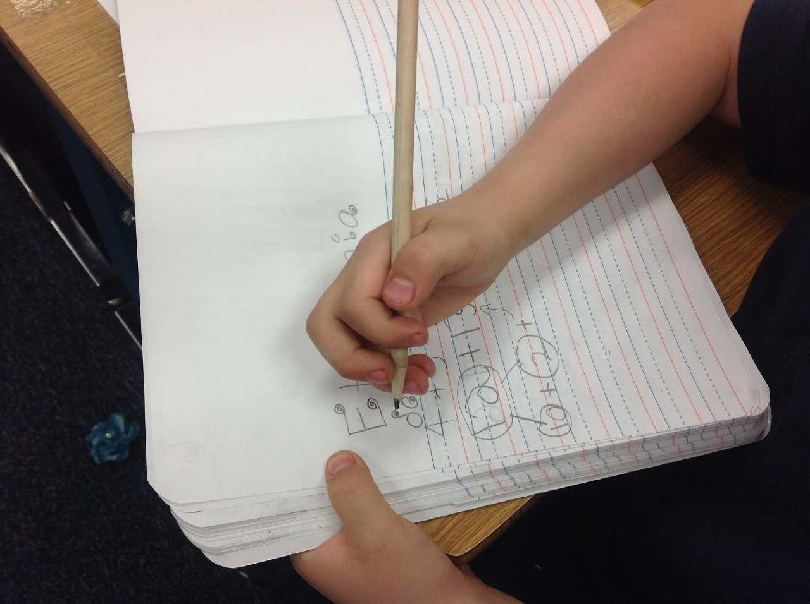

# DIFICULTADES EN LA EXPRESIÓN ESCRITA

## ¿A qué llamamos dificultades en la expresión escrita?

La dificultad en la expresión escrita es una deficiencia en la composición de textos escritos en la que los problemas más habituales son:

*   Problemas ortográficos
    
*   Grafía deficitaria en situaciones de copia, escritura al dictado y escritura espontánea
    
*   Problemas en la corrección gramatical y puntuación
    
*   Problemas de claridad y organización en la expresión escrita
    

La dificultad puede aparecer asociada al déficit del lenguaje y de las habilidades visomotoras que estudiamos en el primer módulo. Es habitual que la dificultad se ponga de manifiesto durante el segundo curso de educación primaria.

## Para reflexión

Revisa los materiales escritos de tus alumnos: ¿Tienen faltas de ortografía? ¿La letra es legible? ¿Los signos de puntuación son correctos? Cuando realiza la copia de un texto ¿presenta faltas ortográficas u obvia algunas de la palabras?