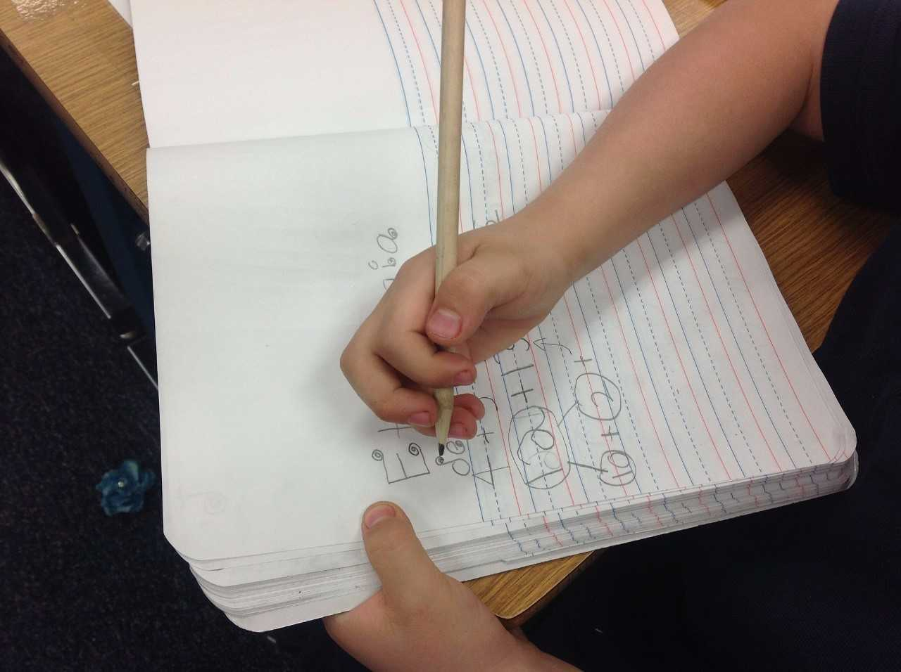

# Discalculia

La discalculia del desarrollo se caracteriza por una dificultad para asimilar y recordar datos numéricos y aritméticos, para realizar procedimientos de cálculo y crear estrategias para la solución de problemas. Los niños con esta alteración pueden presentar dificultades en la comprensión de conceptos numéricos simples, de números, y en el aprendizaje de números y procedimientos numéricos (Geary y Hoard, 2001; Rosselli y Matute, 2011).

Para otros, la discalculia recoge a las dificultades en la matemática o la aritmética (Rebollo y Rodríguez, 2006). Los términos _trastorno del cálculo_ y _discalculia del desarrollo_ o simplemente _discalculia_ son equivalentes para algunos autores.
  
Otros términos frecuentemente utilizados para definir el trastorno incluye _incapacidad para aprender aritmética_ (Koontz y Berch, 1996), _dificultades aritméticas específicas_ (Lewis _et al.,_ 1994), _discapacidad matemática_ (Geary y Hoard, 2001), _dificultades matemáticas_ (Jordan, Kaplan y Hanich, 2002) o simplemente _discalculia_. Kosch en los años 70 enfatizó que esta incapacidad aparece dentro del contexto de habilidades intelectuales generales normales, y acontece con la misma frecuencia en niños y en niñas.

La discalculia del desarrollo no es una alteración uniforme; el tipo de problema numérico y su gravedad presentan variaciones. Se ha descrito, por ejemplo, que a algunos niños les va bien en tareas simples de suma o adición, pero que desempeñan significativamente más bajo que niños sin discalculia de su misma edad, problemas aritméticos más complejos. Otros no pueden dominar conceptos básicos aritméticos a pesar de poseer las destrezas para encontrar soluciones a problemas numéricos; mientras que otros presentan problemas tanto para solucionar problemas aritméticos básicos como para entender problemas más complejos. Se han observado también diferencias en la velocidad de procesamiento y de conteo en varios de estos niños (Roselli y Matute, 2011).

Los errores que se observan con más frecuencia en niños con discalculia al solucionar operaciones aritméticas y problemas numéricos incluyen la organización espacial de cantidades y errores para seguir adecuadamente los procedimientos aritméticos. Existen además errores de tipo atencional gráfico-motores y de memorización de cantidades (Rosselli, Ardila y Matute, 2010). Geary (2000, cit Bermejo y Lago, 2009) sugiere tres tipos de errores: _procedimental_ (dificultades en la aplicación de algoritmos y uso inmaduro de estrategias, siendo su ejecución similar a la de un niño de menor edad);  _visoespacial_  (problemas en la representación e interpretación espacial de la información numérica, tales como dificultades de alineación de los números, en los problemas de aritmética con múltiples columnas o rotación de números. No está asociado a dificultades lectoras y se relaciona con posibles disfunciones en el hemisferio derecho). Y déficit en la _memoria semántica_ (errores en la evocación de hechos numéricos; y suele estar asociado con dificultades de lectura de tipo fonológico).

Algunos investigadores han sugerido que los sistemas cognitivos que median la producción y comprensión numérica están intactos en los niños con problemas en matemáticas, mientras que otros sistemas cognitivos pueden estar alterados (Geary y Hoard, 2001). La investigación en neurociencia apunta a una disfunción del lóbulo parietal en la que se encuentran implicados ambos hemisferios, el izquierdo, en pensamiento aritmético, y el derecho, en tareas de comparación y de aproximación de números (Serra-Grabulosa et al., 2010). Otros investigadores han encontrado también alteradas la memoria semántica y la memoria operativa en estos niños. En esta dirección, **la investigación distingue entre diversas teorías, como mecanismos cognitivos que subyacen a la discalculia del desarrollo** (Castro-Cañizares, Estévez-Pérez y Reigosa-Crespo, 2009):

1.  **_Hipótesis del déficit en los procesos mentales de propósito general_**: se ha propuesto que la discalculia del desarrollo es secundaria a déficit en procesos de dominio general, como la memoria de trabajo, el razonamiento verbal y las habilidades visoespaciales.
    
2.  **_Hipótesis del déficit en la representación numérica_**: se asume que la discalculia del desarrollo es el resultado de un fallo en el desarrollo de sistemas especializados del cerebro que subyacen al procesamiento de la numerosidad. Para ello se han elaborado dos propuestas: hipótesis del módulo numérico defectuoso e hipótesis del déficit del sentido numérico.
    
3.  **_Hipótesis del déficit de acceso_**: se postula que los niños con discalculia del desarrollo no tienen un déficit en el procesamiento de la numerosidad, sino en el acceso a la representación de cantidades a través de los símbolos numéricos.
    
4.  **_Hipótesis de la magnitud:_** las dificultades en las matemáticas aparecen como producto del déficit de un sistema central de procesamiento de magnitudes dedicado al procesamiento tanto de cantidades discretas (numéricas) como de cantidades continuas (densidad, intensidad, etc.)
    

En la actualidad no hay acuerdo acerca de estas hipótesis, entre otras explicaciones se encuentra el hecho de que **no existen unos criterios claros para la identificación de la discalculia**. Por otra parte, existen evidencias de que los niños discalcúlicos pueden pasar inadvertidos si disponen de un tiempo ilimitado para resolver las tareas (Castro-Cañizares, Estévez-Pérez y Reigosa-Crespo, 2009).

 Una de las clasificaciones clásicas de la discalculia es la de Kosch en los años 70, así hablaba de:

*   **_Discalculia verbal:_** definida como una incapacidad para entender conceptos matemáticos y relaciones presentadas oralmente.
    
*   **_Discalculia léxica:_** definida como la dificultad en la habilidad para leer símbolos matemáticos o números.
    
*   **_Discalculia gráfica:_** descrita como la incapacidad para manipular símbolos matemáticos en la escritura, por lo tanto, el niño/a no es capaz de escribir números al dictado o incluso de copiarlos.
    
*   **_Discalculia operacional:_** descrita como la incapacidad para realizar las diferentes operaciones matemáticas requeridas.
    
*   **_Discalculia practognóstica:_** que consiste en un trastorno en la manipulación de objetos, que repercute en la realización de comparaciones de tamaño, cantidad, etc.
    
*   **_Discalculia ideognóstica:_** definida como la inhabilidad para entender conceptos matemáticos, relaciones y realizar adecuadamente cálculos mentales.
    

Pueden aparecer de manera aislada o combinada.

En esta misma dirección, Geary y Hoard (2001) hablan de subtipos:

*   **_Subtipo1 o dificultad de la memoria semántica:_** baja frecuencia de recuperación de hechos numéricos, disfunción en regiones posteriores del hemisferio izquierdo, frecuente asociación a problemas lectores relacionados con el déficit fonológico.
    
*   **_Subtipo 2 o dificultad matemática procedural:_ **uso frecuente de procedimientos propios de edades más tempranas, errores en las ejecuciones de procedimientos, retraso evolutivo en la comprensión de conceptos subyacentes a los procedimientos.
    
*   **_Subtipo 3 o dificultad matemática visoespacial:_** dificultades en la representación espacial de información numérica, errores en la representación espacial de la información numérica, asociado a disfunción en regiones posteriores del hemisferio derecho.