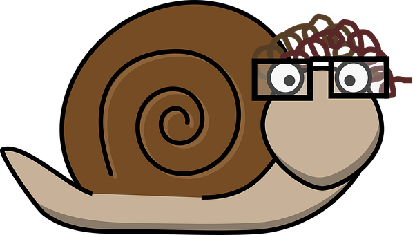

# FUNCIONES EJECUTIVAS

## 

Las funciones ejecutivas están consideradas capacidades cognitivas de “alto nivel”, altamente relacionadas con la atención, e implicadas en procesos ligados a la planificación, la flexibilidad cognitiva y la supervisión de la conducta, entre otros. Además, las funciones ejecutivas están implicadas tanto en la vida diaria como en el aprendizaje y el rendimiento académico.

A lo largo de este apartado podremos conocer con mayor profundidad cómo se han definido y caracterizado las funciones ejecutivas. Además, analizaremos su patrón de desarrollo general, incidiendo en las manifestaciones de dificultades por parte de nuestros alumnos. Para finalizar, plantearemos diferentes tipos de actividades que nos permitan promover su desarrollo dentro del aula.

  
                                      _ Imagen tomada de Pixabay_

_Pixabay_

##   
Para reflexión

Piensa en una actividad de la vida diaria como es la de conducir ¿Crees que es necesario algún tipo de actividad cognitiva cuando ya se posee cierto grado de destreza al volante?

Ahora piensa en las siguientes posibilidades mientras conduces:

1\. La ruta que estás siguiendo tiene mucho tráfico, y te planteas: ¿hay otra ruta alternativa? ¿cómo tomo esa ruta?

2\. Las condiciones meteorológicas se vuelven adversas, y te planteas ¿puedo seguir conduciendo a la misma velocidad?

3\. Un conductor frena en seco justo delante de ti, ¿debo mantener la marcha?

4\. Otro conductor comete una infracción, entorpeciendo tu conducción, ¿cómo reacciono?, ¿debo decirle algo?

Aunque conducir puede convertirse en una actividad con gran número de procesos automatizados gracias a la práctica, la conducción en la vida real nos sitúa ante circunstancias en las que debemos mantener la atención y ser flexibles para cambiar nuestros planes, actualizar la información que percibimos y adaptarnos a los cambios, e inhibir determinadas acciones o conductas, entre otras. Este tipo de procesos estarían asociados a lo que se ha denominado funciones ejecutivas. 

**Vamos a ver en qué consisten las funciones ejecutivas  
  
  
**

_Pixabay_

## **  
Para saber más  
[La función ejecutiva: habilidades para la vida y el aprendizaje](https://www.youtube.com/watch?v=FxXjxpPrXgI)**