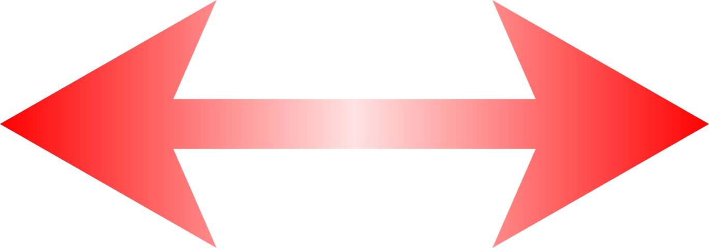

# Habilidades visoespaciales

# ¿A qué llamamos habilidades visoespaciales?

Según Ortega et al. (2014), las funciones visoespaciales constituyen un grupo de funciones cognitivas que nos permiten analizar, comprender y manejar el espacio en el que vivimos. Gracias a ellas tenemos consciencia de nuestra posición en el espacio en relación con otros objetos, así como la relación de unos objetos respecto a otros.

Las utilizamos continuamente para calcular distancias y no chocarnos con objetos, rotar imágenes en nuestra mente o evocar un recuerdo y navegar por él. Todo esto es posible gracias a que dentro de estos procesos se encuentran la percepción de la distancia y profundidad, la navegación mental, las imágenes en 2 y 3 dimensiones, así como la construcción viso-espacial.

Actividades como la que aparece a continuación, podemos realizarlas gracias a que contamos con nuestras habilidades visoespaciales: 

  
  
**Indica cuáles de estas puertas y ventanas se encuentran en una posición incorrecta**  
  

_Imagen tomada de Pixabay_

 Este sistema cuenta con tres grandes habilidades que facilitan el análisis del espacio (AOA, 2010): 

*   **Integración bilateral**
    
    Es la habilidad para usar los dos lados del cuerpo en forma simultánea y por separado de una forma consciente. Cumple la función de dar el fundamento motor para comprender la diferencia entre los lados derecho e izquierdo del cuerpo y requiere de un adecuado control motor y esquema corporal desarrrollado (Merchán y Henao, 2011).
*   **Lateralidad. **
    
    Constituye el dominio funcional de un lado del cuerpo sobre el otro, de manera que preferimos utilizar la mano, pie, ojo y oído de uno de los lados de nuestro cuerpo. De cara a la comprensión de los estímulos visuales, esta función nos permitirá identificar en nosotros mismos y de manera consciente la derecha y la izquierda (AOA, 2010).   
    En algunos casos, se dará la lateralidad cruzada, que consiste en que nuestra preferencia en el uso de mano, pie, ojo u oído, no coincide con el resto, de manera que podemos preferir utilizar nuestra mano derecha pero nuestra pierna, ojo y oído dominantes se encontrarán en el lado izquierdo de nuestro cuerpo (Mayollas, Villarrolla y Reverter, 2010). En estos casos, se presentarán más dificultades en la adquisición de un esquema corporal adecuado, así como en la comprensión de dimensiones espaciales (abajo-arriba, delante-detrás, derecha-izquierda).   
      
    
*   **Direccionalidad.   
      
    **
La direccionalidad es la habilidad para interpretar direcciones hacia la izquierda o derecha en el espacio exterior, es decir, poder reconocer derecha e izquierda más allá de uno mismo. Consta a su vez de tres habilidades (Merchán y Henao, 2011): 

*   Habilidad para identificar la posición direccional de los objetos en el espacio: “¿La puerta está a mi derecha o a mi izquierda?”.
    
*   Habilidad para identificar la posición derecha o izquierda de otra persona. Esto depende de la comprensión de que las posiciones derechas o izquierdas cambian de acuerdo a la orientación de la persona. 
    
*   La habilidad para aplicar conceptos direccionales en la orientación espacial de los símbolos lingüísticos —como p y q—.  
      
      
    

_Imagen de Pixabay_

Para que su funcionamiento sea óptimo será necesario que se haya desarrollado un buen conocimiento del esquema corporal, así como un control motor voluntario adecuado de nuestro propio cuerpo. El buen funcionamiento de este sistema se encuentra relacionado con el equilibrio, los movimientos corporales coordinados, la capacidad de moverse por el entorno sin chocar con objetos, seguir direcciones espaciales, así como comprender la orientación de símbolos alfanuméricos (Conde y Viciana, 2006). 

## **  
  
Relación con el aprendizaje**

_Imagen tomada de Pixabay_

Las habilidades visoespaciales se irán desarrollando desde nuestros primeros meses de vida hasta aproximadamente el inicio del segundo ciclo de primaria. Durante todo este proceso, el niño irá adquiriendo las habilidades básicas que le permitirán llegar a desarrollar la capacidad de crear una imagen mental y operar sobre ella en colaboración con sus habilidades visoperceptivas.

Cuando su funcionamiento se está desarrollando adecuadamente, las habilidades visoespaciales facilitarán la adquisición adecuada de las habilidades académicas. Gracias al análisis visoespacial, podemos organizar el espacio a la hora de escribir y dibujar, nos permiten reconocer la direccionalidad de las letras para tener un buen reconocimiento (d-b), seguir la frase en la misma línea cuando leemos, desarrollar tareas matemáticas que requieran el uso del espacio o participar en actividades deportivas. Por el contrario, un desarrollo inadecuado de estas habilidades puede llevarnos a la adquisición de dificultades de aprendizaje (Conde y Viciana, 2006; Medrano, 2011; Tosto et al., 2014).

  
  
Según la American Optometric Association (2010), los objetivos a conseguir para obtener un funcionamiento adecuado de las habilidades visoespaciales serán:

*   Desarrollar las habilidades de planificación motora necesarias para realizar movimientos simultáneos y aislados de los miembros de su cuerpo
    
*   Desarrollar la consciencia motora de derecha e izquierda en su propio cuerpo 
    
*   Desarrollar la experiencia consciente de ambos lados del cuerpo
    
*   Identificar las distintas partes del cuerpo en sí mismo y en los demás 
    
*   Desarrollar la capacidad de proyectar conceptos direccionales para organizar el espacio visual, incluyendo la orientación espacial de símbolos alfanuméricos
    

Tal y como se puede comprobar, la mayoría de ellos se encuentran dirigidos al desarrollo del esquema corporal y de la interiorización del concepto de derecha-izquierda. Sin embargo, una vez adquiridos estos conceptos será necesario seguir perfeccionando el manejo de las habilidades visoespaciales. De esta manera, aunque su adquisición se produce relativamente pronto a lo largo de nuestro desarrollo, podremos ir perfeccionando esta habilidad a lo largo de toda nuestra vida.