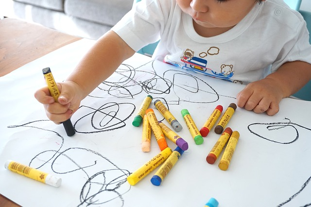
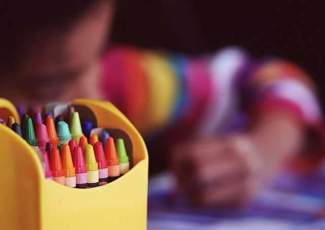

# Habilidades visomotoras

# ¿A qué llamamos habilidades visomotoras?

Las habilidades visomotoras permiten integrar el procesamiento de la  información visual con la motricidad fina. Gracias a ellas somos capaces de convertir un estímulo visual abstracto en un movimiento motor, tal y como se puede comprobar cuando copiamos un dibujo, lo creamos en base a nuestras preferencias y conocimiento del mundo o cuando escribimos (AOA, 2010).  

Para que las habilidades visomotoras tengan lugar, no basta con que exista una buena coordinación entre el sistema visual y el sistema motor, será también necesario contar con una adecuada coordinación motora fina, y una capacidad de percepción de la forma suficiente como para comprender las características del estímulo visual (Merchán y Henao, 2011). Uno de los aspectos más relacionados con la coordinación motora fina, será la coordinación óculo-manual, tan necesaria en los procesos de aprendizaje.

Esta habilidad nos permite realizar actividades en las que usamos simultáneamente los ojos y las manos: con los ojos dirigiremos nuestra atención al estímulo visual, y con las manos ejecutaremos la tarea. Los ojos irán haciendo un seguimiento de lo que realizamos para poder ir dándonos un _feedback_ acerca de cómo lo estamos haciendo. La coordinación óculo-manual constituye una habilidad cognitiva especialmente importante en nuestro desarrollo ya que forma parte de uno de nuestro primeros logros en la interacción con el mundo cuando somos bebés y nos acompaña el resto de nuestra vida. Cuando cortamos una cebolla, cocinamos, pintamos, introducimos una moneda en una máquina para comprar un refresco o conducimos, estamos haciendo uso de nuestras habilidades visomotoras. La información visual que recibimos a través de nuestros ojos nos lleva a actuar de manera coordinada con la información que hemos recibido (Goldstane, Kolslowe y Parush, 2005).  
  

# Relación con el aprendizaje

Las habilidades visomotrices cumplen una función crucial en la capacidad de representar con nuestras manos y nuestro cuerpo un concepto, ya sea escribiendo, dibujando, moldeando, cortando o representando una figura en el aire. Una adquisición deficitaria de estas habilidades, conllevará la aparición de dificultades en el aprendizaje, viéndose representadas principalmente en la escritura (Medrado, 2011; Roselli, Matute y Ardila, 2010). 

Una integración visomotora pobre provocará enlentecimiento en la escritura y dificultades para escribir de manera adecuada y legible. Por tanto, tendrán que emplear muchos recursos en la producción escrita, teniendo dificultades en la automatización del proceso de escritura (Barnhardt et al., 2005).  
  
Según la American Optometric Association (2010), los objetivos a conseguir para obtener un funcionamiento adecuado de las habilidades visomotoras serán:

*   Desarrollar la habilidad de integrar el procesamiento visual con la motricidad fina para reproducir estímulos visuales complejos
    
*   Desarrollar las habilidades del procesamiento visual con las habilidades lingüísticas