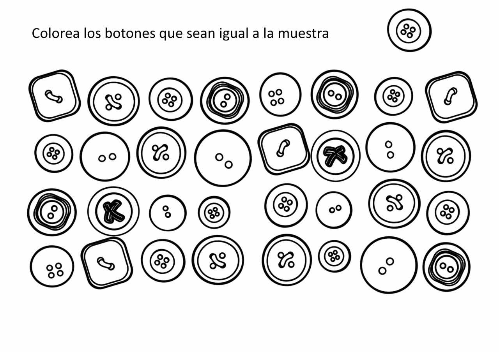
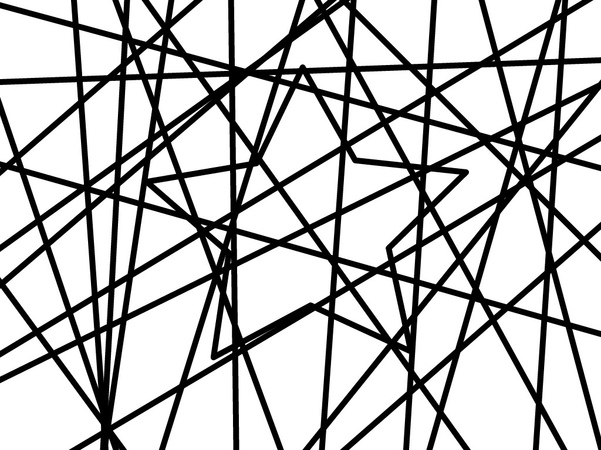
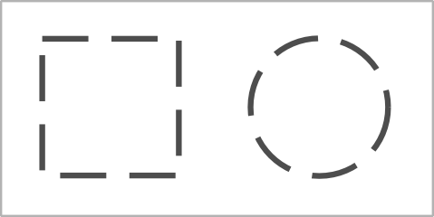
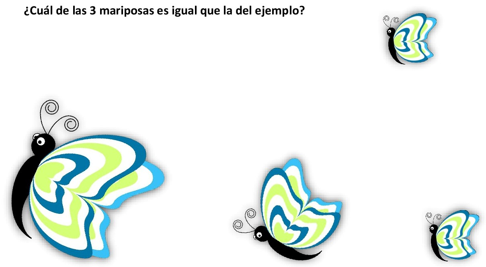
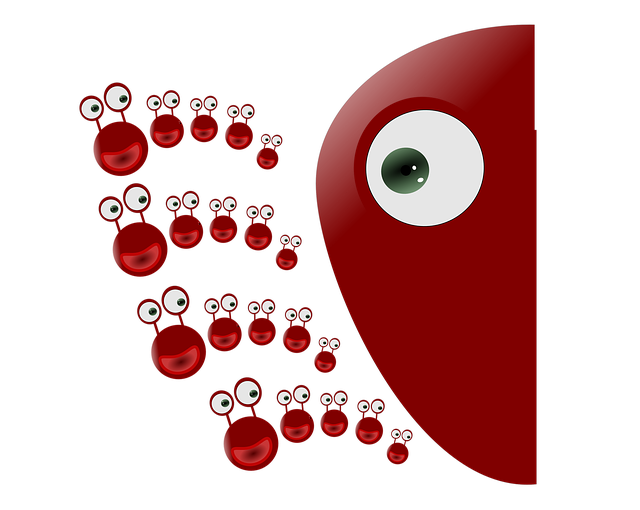

# Habilidades visoperceptivas

_Imagen tomada de Pixabay_

##   
¿A qué llamamos habilidades visoperceptivas?

Las habilidades visoperceptivas son aquellas que nos permiten reconocer y discriminar los estímulos visuales. Gracias a ellas reconocemos formas, tamaños y colores, permitiéndonos realizar actividades de reconocimiento, recuerdo y manipulación de la información visual. Constituye una herramienta básica a la hora de interpretar, atribuir y asociar lo que vemos a ciertas categorías ya conocidas e integrarlo al conocimiento que ya poseemos. De esta manera, cuando leemos un texto o nos enfrentamos a un problema matemático, las habilidades visoperceptivas nos permitirán procesar la información e interpretarla de cara a comprender aquello que estamos percibiendo (AOA, 2010). 

  
  
Para que las habilidades visoperceptivas tengan lugar, es necesario que trabajen en común la atención, la memoria visual, la velocidad de procesamiento y las habilidades que nos permiten analizar la forma.

1.  La **atención** será necesaria para analizar, organizar y determinar los aspectos sobresalientes del estímulo visual, así como para facilitar que el niño se mantenga en la tarea el tiempo necesario.  
      
    
2.  La **memoria visoespacial** permitirá que se recuerde la localización del estímulo  
      
    
3.  La **memoria visual** **a corto plazo**, nos facilitará recordar la secuencia exacta de los ítems visuales que se hayan percibido.  
      
    
4.  La **velocidad de procesamiento** -que es la habilidad para realizar tareas rápidamente optimizando el esfuerzo cognitivo- se encontrará intrínsecamente relacionada con un procesamiento de la información rápido y eficaz; si por el contrario es lenta, es probable que quede afectada la comprensión de aquello que se está leyendo, haciendo o queriendo comprender.  
      
    
5.  Por último, se encuentran las habilidades relacionadas con la **percepción de la forma, que son aquellas que se encuentran más relacionadas con las habilidades visoperceptivas**. Esta función se encuentra subdividida en otros cuatro procesos (Merchán y Henao, 2011):  
      
      
    *   **Discriminación visual.**   
        Es la habilidad que nos permite analizar el tamaño, orientación o color de un objeto, obteniendo así las habilidades necesarias para determinar diferencias y similitudes entre objetos.  Ejercicios como los que se muestran en la imagen, permiten que el niño realice un análisis de las características del estímulo visual, haciendo que preste atención a los detalles de cada una de las imágenes. Esta habilidad, la necesitamos en nuestro día a día para comprender el modo en el que se conforma nuestro mundo, por lo que es conveniente potenciar su desarrollo desde edades tempranas.    
          
        

        

        
        _Imagen tomada de Pixabay_
        
          
        
    *   **Figura y fondo  
        **Es la habilidad para atender a un aspecto específico de la forma mientras mantiene consciencia de las relaciones entre la forma y la información del fondo. En la imagen podemos ver un ejercicio clásico que se realiza con niños. El objetivo es que aprendan a distinguir una forma que tenga sentido en la realidad, inhibiendo toda aquella información que no sea válida para la comprensión del estímulo visual. Cuando esta habilidad se encuentra desarrollada correctamente, la persona es mucho más hábil a la hora de comprender el mundo que le rodea, ya que potencia la capacidad de simbolización del niño/adulto.  
          
        
        **¿Qué imagen se encuentra escondida en este dibujo?**
        

        

        
        _Imagen cedida por Fabio Cabello (Unidad Cerebral)_
        
    *   **Cerramiento visual.   
        **Es la habilidad para reconocer claves de un estímulo visual que permita a la persona determinar la forma final sin necesidad de tener todos los detalles presentes. En la imagen que aparece a continuación, podemos ver que hay un cuadrado y un círculo, a pesar de que las líneas no se encuentran unidas. Esto podemos percibirlo gracias a que somos capaces de analizar el estímulo no a través de sus partes (las pequeñas rayas que configuran cada dibujo), sino que somos capaces de ver una forma completa a pesar de que falta información. Los ejercicios de cerramiento visual pueden ayudarles a configurar un modo de analizar la información más completo.  
          
        
        **¿Qué figuras geométricas aparecen en la imagen?**
        

        

        
        _Imagen tomada de Wikimedia_
        
          
          
          
        
    *   **Constancia visual de la forma  
        **Es la habilidad para identificar los aspectos invariantes de la forma cuando se ha alterado el tamaño, la rotación o la orientación. Esta función permite que reconozcamos un estímulo visual a pesar de que no sea exactamente igual. Para ello, será necesario contar con unas adecuadas habilidades visoespaciales y memoria visual, ya que será necesario que manejemos esa información en nuestra mente para poder llegar a una conclusión. La imagen que aparece a continuación, recoge una actividad de las más sencillas que se pueden proponer, ya que sólo debe manejar la variable tamaño. 

_Imagen de elaboración propia_

# **  
Relación con el aprendizaje**

_Imagen tomada de Pixabay_

  
Tal y como hemos visto, las habilidades visoperceptivas son aquellas que nos van a permitir percibir el mundo en toda su complejidad. Gracias a ellas, seremos capaces de analizar los objetos en función de sus atributos (forma, color, tamaño, contraste, orientación o movimiento) e incluirlos en una determinada categoría.

De cara al aprendizaje, estas habilidades nos van a facilitar el reconocimiento y posterior discriminación de los signos y símbolos; es decir, gracias a ellas podemos reconocer las letras, números, dibujos y objetos, así como discriminar cuál es su significado. Sin las habilidades visoperceptivas el mundo se reduciría a un conjunto de rayas, puntos y bordes sin tener un sentido global, ya que no contaríamos con las herramientas perceptivas que nos permiten discriminar las características de un objeto y comprender qué estamos viendo. Por tanto, cuanta mayor sea nuestra habilidad para analizar las características de los estímulos visuales de manera automática, mejor podremos interactuar con el mundo (Ortega et al., 2014). 

Por otra parte, las habilidades visoperceptivas establecen una relación directa con la lectura, de manera que ayudarán al niño en la adquisición de las convenciones direccionales de la lectura, influirán en la habilidad del niño para recordar las letras impresas y no confundirlas, y finalmente, se encontrarán relacionadas con la habilidad del niño de retener lo que lee (Medrano, 2011; Roselli, Matute y Ardila, 2010). 

Según la American Optometric Association (2010), los objetivos a conseguir para obtener un funcionamiento adecuado de las habilidades visoperceptivas serán:

*   Desarrollar la comprensión de las características distintivas de los objetos: tamaño, forma, color y orientación
    
*   Desarrollar la capacidad de seleccionar y atender a un estímulo que se encuentre junto con otros estímulos distractores, así como analizar la relación espacial de ese estímulo en relación con otros estímulos de fondo
    
*   Desarrollar la capacidad de identificación de estímulos visuales a partir de información visual incompleta
    
*   Desarrollar habilidades de memoria visual a corto plazo, incluyendo el recuerdo de las características espaciales del estímulo y la secuencia de aparición
    
*   Desarrollar la habilidad para crear una imagen visual de un estímulo presentado previamente, y manejarlo mentalmente