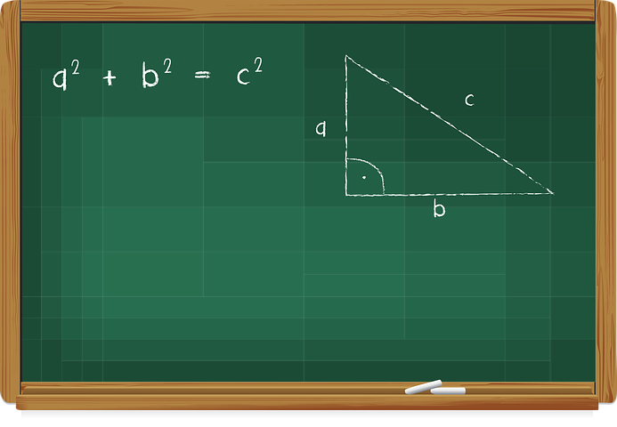

# EL PROCESAMIENTO DEL LENGUAJE

El lenguaje es la capacidad de comunicar o transmitir información mediante signos arbitrarios, sonidos verbales o gestos manuales, que tienen una forma convencional y un significado, y se combinan siguiendo unas reglas determinadas (Mariscal, 2009). A lo largo de nuestro desarrollo iremos adquiriendo la capacidad de comunicarnos a través de la estructura que nos aporta el lenguaje, para lo que tendremos que adquirir la función fonético-fonológica, la sintáctico-morfológica, la léxico-semántica y la pragmática. A lo largo de este módulo, analizaremos el lenguaje en función de cuatro grandes niveles de estudio.

El conjunto de estos niveles, nos permite entender el funcionamiento del lenguaje como una función global e indispensable en la interacción con el mundo. Para comprender bien el modo en el que cada uno de estos niveles nos permitirá analizar el lenguaje, retomemos el ejemplo del módulo anterior:

"Juana es una maestra de educación primaria que plantea a sus alumnos el siguiente problema: “En un concurso, Pedro ha obtenido 93 puntos y su pareja María, ha logrado 17 puntos menos que Pedro. ¿Cuántos puntos ha conseguido María? ¿Cuántos puntos han conseguido entre los dos?”

Tal y como indicábamos en el primer módulo, el objetivo principal de plantear problemas matemáticos a nuestros alumnos, es que adquieran el manejo de los mecanismos que nos permiten enfrentarnos a tareas similares en nuestra vida cotidiana. Ya vimos que para llegar a resolver este problema, los niños tendrán que ser capaces de manejar su atención y sus funciones ejecutivas, así como haber adquirido un correcto procesamiento de la información visual. Sin embargo, para completar el análisis de los procesos que requeriría un niño para resolver este problema, debemos incluir el lenguaje.

_  
Imagen tomada de Pixabay_  
  
  
Analicemos por qué:

*   Para comprender el texto que aparece escrito, el alumno deberá ser capaz de interpretar la información visual (o auditiva) y convertirla en palabras y/o fonemas. Para ello deberá haber adquirido la capacidad para identificar fonemas, sílabas y palabras. Esto lo conseguirá gracias al nivel **fonético-fonológico**, que en niños de 3º de primaria debería estar completamente adquirido y automatizado.  
      
    
*   Una vez que cuenta con esta capacidad de identificación, el niño tendrá que ser capaz de analizar la **sintaxis** de la frase, es decir, el modo en el que las palabras de una frase se relacionan entre sí para darnos una información. Volviendo al ejemplo, sintácticamente no será lo mismo decir _"_**Pedro** ha obtenido 93 puntos y su pareja **María** ha logrado 17 puntos más que Pablo"  __que decir"93 puntos han sido conseguidos por **Pedro**, 17 más que su pareja _**María**" _. Sin embargo, a pesar de que no sean iguales sintácticamente, su significado sigue siendo el mismo.   
      
    
*   Por otra parte, el niño tendrá que ser capaz de contar con un **conocimiento semántico**, es decir, un conocimiento acerca del significado de palabras y frases. Como podemos ver, el significado de estas dos frases no será el mismo: "_**Pedro** ha obtenido 93 puntos y su pareja **María** ha logrado 17 puntos menos que Pablo" _que decir_ "_**María** ha obtenido 93 puntos y su pareja **Pedro** ha logrado 17 puntos menos que Pablo"._ _El significado de ambas frases es completamente distinto debido a que hay un cambio semántico.   
      
    
*   Por último, la **pragmática** hace referencia al uso del lenguaje dentro de un mismo contexto, dependiendo, el significado de las palabras, del entorno en el que se produce. Este tipo de lenguaje, suele estar vinculado a aspectos sociales en los que debemos cambiar de registro para adecuarnos al entorno y comprender la intención de nuestros interlocutores. Como veremos más adelante, en este ejemplo la pragmática no sólo se encuentra presente en el uso que se realice del lenguaje en el aula, sino que el lenguaje matemático requerirá de esta función. 

Tal y como podemos ver, para que un alumno sea capaz de resolver un simple problema matemático, será necesario que cuente con la posibilidad de manejar adecuadamente diversos procesos cognitivos (repasa el módulo anterior) y lingüísticos. En ocasiones, cuando un alumno no es capaz de dar una solución a una tarea, no se debe a que no entienda el procedimiento que estamos intentando que adquiera, sino a un problema en el manejo del lenguaje.

A lo largo de este módulo analizaremos los distintos niveles del lenguaje en los que puede producirse alguna alteración que impida el desarrollo académico óptimo en el niño. Previo a este apartado, repasaremos las principales teorías explicativas acerca de la adquisición del lenguaje. 

_Pixabay  
_

##   
Para saber más

[Documental "El cerebro y yo - El lenguaje"](https://www.youtube.com/watch?v=n0brAVKHQa4)

[Documental Adquisición y desarrollo del lenguaje en la infancia](https://www.youtube.com/watch?v=AWsaKZS_ZKY)