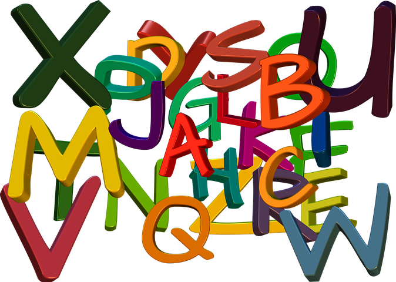

# INTRODUCCIÓN GENERAL AL CURSO

Las dificultades de aprendizaje fueron definidas inicialmente por Kirk y Bateman en la década de los 60. Debido a la gran complejidad del propio concepto, han sido objeto de controversia a lo largo del tiempo, generando mayores dificultades en su detección y tratamiento. Algunas de las razones que pueden explicar la dificultad que aparece a la hora de estudiarlas son: problemas relacionados con las consideraciones conceptuales, los criterios de discrepancia a la hora de definirlas, la sobre-identificación de alumnos con DA, la variabilidad existente entre los alumnos con DA, la especificidad de las dificultades encontradas, y la identificación temprana.

A día de hoy existe un cierto acuerdo en que, para la identificación de las dificultades de aprendizaje, se deben seguir cinco grandes pasos en la evaluación y estudio:   

1.  Existencia de bajo rendimiento académico.

2.  Déficits generalizados en aprendizajes básicos, principalmente asociados a las áreas académicas de lenguaje, lectura, escritura y matemáticas.
   
3.  Dificultades en la eficiencia del aprendizaje, incluyendo medidas de uso de estrategias y de ritmo de aprendizaje.
    
4.  Déficits en procesos psicológicos básicos, incluyendo atención, memoria, procesamiento lingüístico y metacognición.
    
5.  La exclusión de causas alternativas, como la existencia de discapacidad intelectual y/o sensorial, problemas emocionales o instrucción inadecuada.
    

Teniendo todo esto en cuenta, podemos decir que las DA se manifiestan principalmente en los aprendizajes instrumentales básicos (lectura, escritura y aritmética), y están asociadas a déficits en diferentes tipos de procesos cognitivos. A lo largo de este curso profundizaremos en el funcionamiento de algunos de estos procesos, conociendo en qué consisten, cuál es su desarrollo normativo, así como las señales de alerta a las que debemos estar atentos, para poder desarrollar estrategias educativas de intervención en el aula.

En el módulo 1 abordaremos los procesos generales implicados en el aprendizaje: la atención, las habilidades visoespaciales y visoperceptivas y las funciones ejecutivas; en el módulo 2, nos centraremos en procesos de carácter específico, ligados al lenguaje (verbal y aspectos básicos del matemático). Finalmente, en el módulo 3, analizaremos las particularidades de la dislexia, la disgrafía y la discalculia, que son las DA que más comúnmente podemos encontrarnos en el aula.  
  

##   Para saber más
  
[¿Cómo aprende nuestro cerebro! Explicación según la Teoría PASS de la inteligencia](https://www.youtube.com/watch?v=-6PMFRwvYug "¿Cómo aprende nuestro cerebro?")

[En qué consiste la Teoría Pass de la inteligencia](http://www.svplaredo.es/do_archivos/Teoria_PASS.pdf)