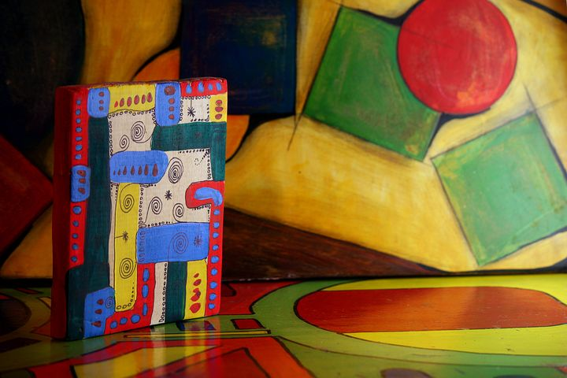

# PROCESAMIENTO DE LA INFORMACIÓN VISUAL

_Imagen tomada de Pixabay_

  
Mirar a nuestro alrededor y comprender lo que vemos de un simple vistazo, nos parece una tarea sencilla, algo a lo que no prestamos atención por tratarse de algo natural en nuestro día a día. Sin embargo, que seamos capaces de identificar un objeto y decir convencidos que se trata de un "árbol" requiere de un proceso complejo en el que se verán implicados varios mecanismos cognitivos.

Este proceso lo iremos adquiriendo a lo largo de nuestro primeros años de vida, y se irá especializando según vayamos creciendo. Su desarrollo se encontrará muy ligado a la obtención de aprendizajes instrumentales básicos, así como a la aparición de dificultades de aprendizaje en aquellos casos en los que existe algún tipo de dificultad en el procesamiento de la información visual.  

A lo largo de este apartado veremos en qué consiste el procesamiento de la información visual, ahondaremos en el concepto de habilidades visoespaciales, habilidades visoperceptivas y habilidades visomotoras, analizando en cada una de ella en qué consisten y cuál es su relación con el aprendizaje. Por último, veremos cuál es el desarrollo normativo de estas habilidades en el niño, cuáles son las señales de alerta a las que debemos estar atentos, así como cuándo y cómo se debe trabajar en el aula de manera específica.  
  
  

_Pixabay_

##   
Para reflexión:

Para entender de qué vamos a hablar a lo largo de este apartado, hagamos un pequeño ejercicio: Observa la imagen que aparece debajo y contesta las preguntas que se encuentran a continuación. 

_Imagen tomada de Pixabay_ 

_1\. ¿Qué es lo que muestra el dibujo?_

_2\. Habrás reconocido que son casas y árboles ¿Cuáles son más altas? ¿Cuáles son azules? ¿De qué formas son las casas?_

_3\. ¿Cómo es la casa que se encuentra a la izquierda del dibujo?_

_4\. Señala los árboles, escoge uno de ellos y dibújalo en un papel._

  
  
Si has sido capaz de hacer cada una de estas actividades es en parte gracias a que tienes un sistema visual que te permite procesar la información que te llega a través de los ojos. Por un lado, gracias a la agudeza y eficacia visual -que dependen de la estructura ocular- puedes recoger la información del exterior de manera nítida. Por otro, las habilidades visoespaciales, visoperceptivas y visomotoras  te ayudan a identificar qué y cómo es el estímulo, así como saber dónde se encuentra. 

**Vamos a ver bien en qué consiste el procesamiento de la información visual**