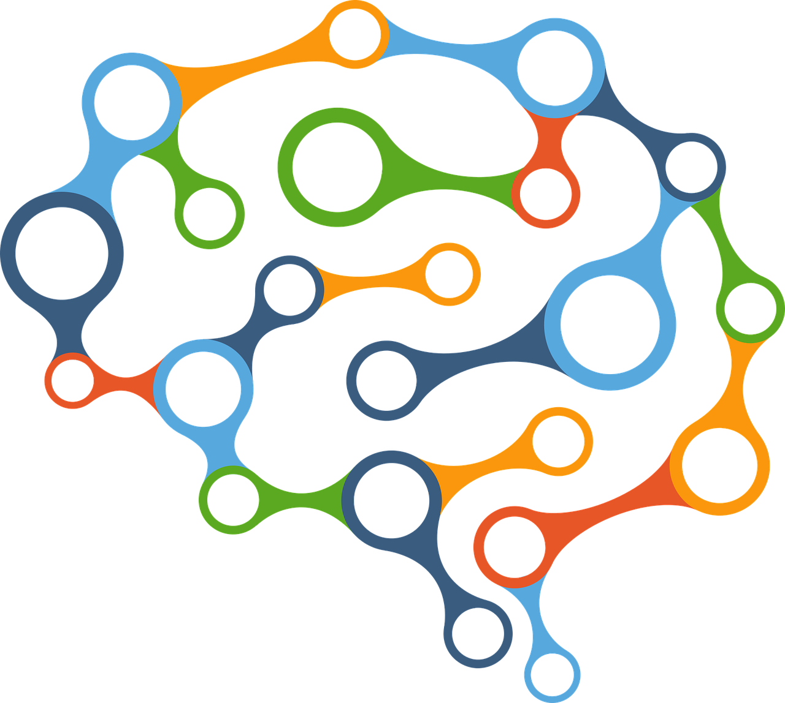

# PROCESOS COGNITIVOS

A lo largo de este módulo analizaremos a qué llamamos atención, procesamiento de la información visual y funciones ejecutivas, así como el modo en el que podemos utilizar este conocimiento en el aula. Sin embargo, a pesar de que vayamos a estudiar estos procesos por separado, la realidad es que actúan de manera conjunta, permitiéndonos desarrollar nuestro conocimiento del mundo. Para ver el modo en el que interactúan entre sí, veamos un ejemplo:

Juana es una maestra de educación primaria que plantea a sus alumnos el siguiente problema: “En un concurso, Pedro ha obtenido 93 puntos y su pareja María, ha logrado 17 puntos menos que Pedro. ¿Cuántos puntos ha conseguido María? ¿Cuántos puntos han conseguido entre los dos?”

Uno de los objetivos principales de plantear problemas matemáticos a nuestros alumnos, es que adquieran el manejo de los mecanismos que nos permiten enfrentarnos a tareas similares en nuestra vida cotidiana, de tal manera que evaluamos si el alumno ha aprendido o no a interpretar el resultado, razonar y manejar el cálculo. Sin embargo, para que nuestros alumnos sean capaces de resolver este problema, es necesario que tengan adquiridos otros procesos más básicos como son la atención, el procesamiento perceptivo visual y las funciones ejecutivas. El modo en el que cada uno de estos sistemas actúa para ayudar al niño a realizar la tarea es el siguiente:

*   En primer lugar, los alumnos deberán ser capaces de dirigir su **atención** hacia la tarea. Gracias a ella se podrán centrar en entender el texto, se mantendrán en la tarea hasta que la resuelvan y seleccionarán la información que es relevante de cara a resolver el problema.  
      
    
*   El **procesamiento de la información visual** permitirá al alumno distinguir que los números son números y no letras o garabatos; que el 93 es un 93 y no un 63; o distinguir que para realizar adecuadamente la resta de 93-17 los números deben estar colocados adecuadamente (unidades con unidades y decenas con decenas) para conseguir el resultado correcto.  
      
    
*   Las **funciones ejecutivas **permitirán que el alumno planifique qué pasos debe dar para la resolución del problema, buscar soluciones ante las dificultades que le pueda plantear la tarea o inhibir los estímulos no relevantes del entorno (todo aquello que no sea trabajar en la resolución del problema).

Cuando el alumno presenta un déficit en alguno de estos procesos, su desarrollo académico se verá afectado. En algunos casos se producirá un retraso en el aprendizaje que repercutirá en sus resultados escolares. En otros más graves, aparecerán dificultades de aprendizaje como son la dislexia, la discalculia o la disgrafía, lo que dificultará en el niño la adquisición de aprendizajes tan necesarios para el desarrollo académico del niño como son la lectura, la escritura o el cálculo. Conocer el modo en el que la atención, el procesamiento de la información visual y las funciones ejecutivas participan en la adquisición de los aprendizajes instrumentales básicos, permite al docente generar actividades mejor dirigidas para el aprendizaje. 

A lo largo de este módulo analizaremos en qué consisten cada uno de estos tres procesos, así como la manera en la que se vinculan con el aprendizaje.  
  
##   Para saber más  
  
[Cómo se produce el desarrollo cognitivo en el bebé](https://www.youtube.com/watch?v=vRalfk5KFVw "Cómo se produce el desarrollo cognitivo en el bebé")