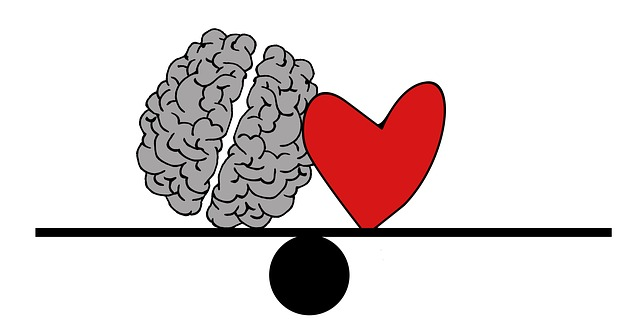

# ¿Qué son las funciones ejecutivas?

_Imagen tomada de Pixabay_

La respuesta a qué son las funciones ejecutivas o qué se entiende por funciones ejecutivas no es fácil. Se trata de un constructo psicológico, una especie de “paraguas conceptual” que implica diversas funciones o procesos cognitivos en el que el aspecto clave es el control y regulación de los pensamientos, emociones y conductas por medio de diferentes procesos cognitivos interconectados. La función principal que cumplen es la de permitir al individuo dar la mejor respuesta posible de cara a conseguir una meta u objetivo.

A lo largo del tiempo, numerosos autores han tratado de dar una definición global de funcionamiento ejecutivo desde diferentes perspectivas teóricas. Cuando se consideran de manera global todas estas aportaciones, podemos asumir que las funciones ejecutivas estarían implicadas tanto en actividades asociadas a la cognición, como en aquellas relacionadas con la vida diaria y a los aspectos emocionales y sociales de las mismas. Además, el funcionamiento ejecutivo estaría directamente relacionado con los procesos atencionales y de supervisión de la conducta.

Teniendo todo esto en cuenta, es lógico pensar que las funciones ejecutivas constituyen una piedra angular en la adquisición de aprendizajes instrumentales básicos, y por tanto, en el desarrollo académico del alumno. Tal y como veíamos, aunque se han descrito diferentes funciones ejecutivas, podemos considerar que aquellas con mayor relevancia en el ámbito educativo son las siguientes:

*   **Inhibición de respuestas.   
    **Se puede reflejar, por ejemplo, en la capacidad para pensar antes de actuar. Permite resistir el impulso de hacer o decir algo, proporcionando tiempo para evaluar la situación y las consecuencias de las acciones. Está muy ligada al control emocional, considerado como la capacidad para gestionar las emociones con el objetivo de lograr metas, completar tareas, o controlar y dirigir la conducta.  
      
    
*   **Flexibilidad cognitiva.   
    **Capacidad para revisar planes frente a las dificultades, contratiempos, nueva información, o errores. Se relaciona con la capacidad de adaptación a condiciones cambiantes.  
      
    
*   **Memoria operativa.   
    **Capacidad para mantener y procesar información en la memoria de manera simultánea. Incorpora la capacidad de recuperar aprendizajes o experiencias previas útiles para la situación actual o para planificar acciones futuras.  
      
    
*   **Planificación/priorización.   
    **Capacidad para crear una “hoja de ruta” para alcanzar un objetivo o completar una tarea. También implica ser capaz de tomar decisiones sobre qué es y qué no es importante.  
      
    
*   **Metacognición.   
    **Capacidad de reflexionar y supervisar la actuación de uno mismo ante diferentes situaciones. Implica la capacidad de observar cómo se resuelven los problemas mediante auto-supervisión y auto-evaluación (ej. Preguntándose a uno mismo ¿cómo lo estoy haciendo?, ¿cómo lo he hecho?). Se relaciona directamente con capacidades asociadas a la gestión del tiempo y la persistencia en los objetivos.